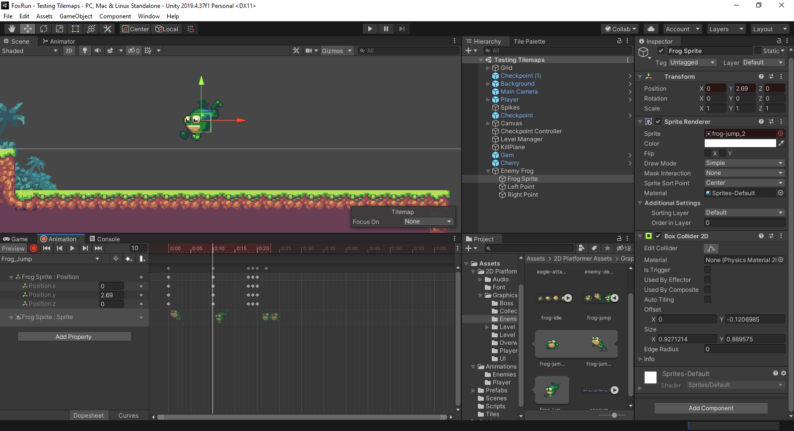
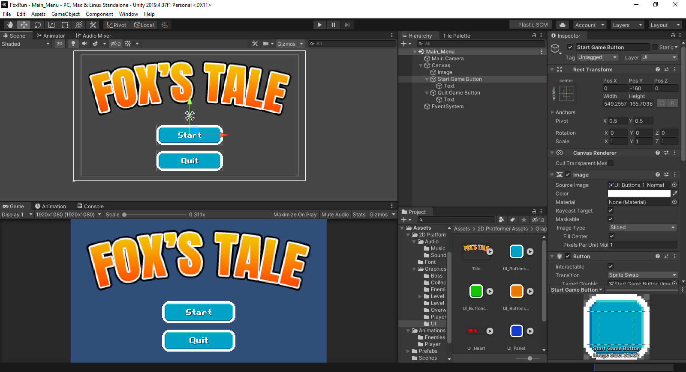

# Fox Run

Phiên bản Unity: 2019

Đôi lúc, việc cải thiện game không nằm ở việc `code` mà nằm ở những cấu hình từ rất nhiều
`component` khác nhau.

Làm ngon phần vật lý trước, hiệu ứng để từ từ.

## 1. Adding Player

Mở thư mục Assets/2D Platformer/ Graphics/Player

Trong này ta sẽ thấy được 1 số sprite về nhân vật cáo.

### 1.1. Setup `player-idle`


- Pixels per units: 16
- Filter mode: point (no filter)
- Compression: none
- Sprite mode: multiple (bởi vì mình có 4 con cáo trong 1 sprite)

  - Chỉnh sửa Sprite của cáo để sử dụng trong Unity
  - Bấm vào Sprite Editor

 

- Chọn `slice`

  - type: `grid by cell size`
  - pixel size: 32 x 32 (tự đo kích thước tương ứng với mỗi sprite)

 

- Lúc tạo `sprite` này, tác giả để 1 ít phần dư, do đó trọng tâm của mỗi nhân vật sau khi cắt bị lệch quá nhiều => đặt padding để sửa

  - chọn `slice`
  - padding: `x:1`

 

- Sau khi dùng `sprite editor` để cắt nhân vật xong, ta nhấn vào `sprite` tại khung project assets, chọn hình đầu tiên của con cáo rồi kéo vào `scene`, sau đó đối tên `player-idle-0` thành `Player`


### 1.2. Sorting Sprites with Layers

1 điều quan trọng là phải đảm bảo được player ở đúng layer.

Sử dụng `sorting layer system` có sẵn trong `unity` để đảm bảo
vị trí của `player` với các `background layer` còn lại.

Chọn vào `Player object`, tại menu `layer`, chọn `add sorting layer`.

- `BG`: background
- `World`: quang cảnh thế giới
- `Player`: người chơi

Ta sẽ thêm vào các layer khác khi tiếp tục phát triển dự án


- Đặt layer của `back`, `middle` thành `BG`
- Đặt layer của `simple_setup_level` thành `World`
- Đặt layer của `Player` thành `Player`

Các `game object` được thêm vào sau sẽ mặc định layer `default`, đều
xếp trên `BG` và `Wolrd`


### 1.3. Giving player physics

- Chọn `Player` game object
- `Add Component`
- Bọc 1 lớp `Rigidbody 2D`


`Rigidbody 2D` sẽ cung cấp 1 số yếu tố vật lý được cung cấp sẵn
bởi hệ thống vật lý. Dùng cái này sẽ thuận tiện và dễ dàng hơn
so với việc tự tính toán các công thức vật lý.

Kéo con cáo đưa lên cao, sau đó nhấn vào `Play`, con cáo sẽ tự rơi xuống
do tác động của trọng lực


Con cáo rớt khỏi màn hình

Để con cáo có thể chạm vào mặt đất (tương tác với các game object khác), ta cần thêm vào 1 số tác động vật lý lên cơ thể thật (`solid body physics`)

- Chọn `Player` game object
- `Add Component`
- Chọn thư mục `Physics 2D`, chọn 1 trong các `collider` ở đây.

  - Thông thường, khi chúng ta tạo ra nhân vật, chúng ta thường
 dùng `box collider` hoặc `capsule collider`.
  - Trong trường hợp này, ta sẽ dùng `capsule collider` cho con cáo
  - Bởi vì dùng `box collider` thì nó hơi bự 1 tí so với con cáo

 

- Vòng tròn mặc định của `capsule collider` hơi to, ta cấu hình để bóp
sát `collider` vào nhân vật.

  - Chọn `component capsule collider` vừa tạo
  - Chọn `edit collider`
  - Kéo các góc sao cho vòng `collider` bao phủ phần thân của con cáo (không cần bao phủ hết)
  - Lúc này, khi thả xuống, nhân vật đã đứng trên mặt đất

 

- Vấn đề nhân vật ngã lăn ra đất

  - Khi nhân vật rớt từ trên xuống, chạm vào góc của bức tường, nó ngã
 lăn ra đất
  - Trong game này, chúng ta không muốn yếu tố vật lý này diễn ra
  - Chọn phần `rigidbody`, kéo xuống phần `constraints`, tick vào `freeze rotation` (khóa xoay)

### 1.4. Moving Player around with some Scripts

Nhấn vào `assets`, tạo folder mới `scripts` để lưu trữ toàn bộ
`scripts`.

1 số quy ước đặt tên `script` thông dụng

- Bắt đầu với chữ in hoa
- Không có dấu gạch ngang ở giữa
- Không được đổi tên `script` sau khi đã gán cho `game object`

Ví dụ, ta tạo 1 script cho đối tượng `Player`, đặt tên là: `PlayerController`

Init script

```csharp
using System.Collections;
using System.Collections.Generic;
using UnityEngine;

public class PlayerController : MonoBehaviour
{
    // Start is called before the first frame update
    void Start()
    {
        
    }

    // Update is called once per frame
    void Update()
    {
        
    }
}
```

### 1.5. Moving the Player

```csharp
using System.Collections;
using System.Collections.Generic;
using UnityEngine;

public class PlayerController : MonoBehaviour
{
    // Start is called before the first frame update
    void Start()
    {
        
    }

    // Update is called once per frame
    void Update()
    {
        
    }
}
```

- `60FPS`: `Update` is called `60 times`
- `30FPS`: `Update` is called `30 times`

Chọn đối tượng `Player`, chọn `PlayerController` script vừa tạo rồi kéo
vào khung `component`.

- Tạo biến `public` trong class, `public float moveSpeed`,
lúc này, tại component script của đối tượng `Player` sẽ có 1
field để ta có thể chỉnh sửa thông số của biến này.


Để di chuyển nhân vật, ta cần truy cập đến các hàm tại đối tượng `RigidBody2D`, đối tượng này ta đã thêm vào nhân vật để mang đến các
hiệu ứng vật lý.

- Đầu tiên, ta cần tạo 1 biến `RidigBody2D` để lưu trữ tham chiếu đến
đối tượng này. Để gán giá trị cho biến này, ta quay lại giao diện `unity`, cầm kéo
thả `component RigidBody2D` vào vị trí trống tương ứng tại phần script.

```csharp
    public Rigidbody2D theBD;
```

- Tiếp theo, ta tiến hành thêm vận tốc (`velocity`) cho nhân vật vào mỗi lần `frame update`

```csharp
    // Update is called once per frame
    void Update()
    {
        theBD.velocity = new Vector2(moveSpeed, theBD.velocity.y);
    }
```

Lúc này, sau mỗi `frame update`, nhân vật sẽ di chuyển theo trục `x` 1 khoảng cách
bằng với giá trị tại biến `moveSpeed`, còn giá trị trục `y` giữ nguyên.

- Để kiểm soát việc di chuyển của nhân vật, ta dùng `Input System` hỗ trợ sẵn từ `unity`.

```csharp
    theBD.velocity = new Vector2(moveSpeed * Input.GetAxis("Horizontal"), theBD.velocity.y);
```

- Nếu bấm mũi tên trái hoặc chữ `A`, `Input.GetAxis("Horizontal")` sẽ mang giá trị -1
- Nếu bấm mũi tên phải hoặc chữ `D`, `Input.GetAxis("Horizontal")` sẽ mang giá trị 1
- Nếu để nguyên thì mang giá trị 0

Để tìm hiểu thêm về các giá trị `Input` này, vào Menu `Edit` > `Project Settings` > `Input Manager`.

### 1.6. Jumping

- Lắng nghe sự kiện người dùng bấm vào nút `space` trong phương thức `update`.
- Tăng giá trị trục `y`, giữ nguyên giá trị trục `x`
- Nhân vật nhảy lên cao, sau đó dựa vào trọng lực để rơi xuống
- Thay đổi độ lớn của trọng lực tác dụng lên nhân vật tại `Rigidbody2D component`: `Gravity Scale`
- Tạo biến `public float jumpForce` để đặt độ cao khi nhân vật nhảy

- `gravity scale` tăng lên nghĩa là nhân vật nặng hơn, `jump force` cũng tăng theo
- `GetButtonDown` diễn ra khi người dùng vừa nhấn vào 1 nút
- `GetButton` diễn ra khi người dùng nhấn nút hoặc giữ nút
- `GetButtonUp` diễn ra khi người dùng thả nút vừa nhấn
- `Jump` là 1 giá trị trong `Input system`, vào `Input Manager` để xem chi tiết

```csharp
    void Update()
    {
        theBD.velocity = new Vector2(moveSpeed * Input.GetAxis("Horizontal"), theBD.velocity.y);

        if (Input.GetButtonDown("Jump"))
        {
            theBD.velocity = new Vector2(theBD.velocity.x, jumpForce);
        }
    }
```


### 1.7. Improving Gameplay Feel

- Khi nhảy lên rồi rớt xuống, 2 chân con cáo lún vào mặt đất, sau đó nó `reset` 2 chân lên mặt đất (cảm giác bị lag)

  - Lý do: hệ thống vật lý được chạy mỗi lần hàm `update` được gọi (xem code)
  - Trọng lực
  - Mỗi `frame update`, nhân vật rớt xuống 1 tí
  - Rớt 1 hồi thì nó nằm trong lòng đất
  - Sau đó hệ thống check `oops`, chân nhân vật này không được nằm dưới mặt đất, do đó hệ thống tự set lại, đặt nhân
 vật phía trên mặt đất
- Cách sửa: vào `component Rigidbody2d`, đặt thuộc tính `Collision detection` thành `continous`: lúc này
 mỗi lần `frame update`, hệ thống sẽ luôn check `collison` để đảm bảo rằng nhân vật không vô ý chui vào lòng đất

- Khi nhân vật đi đến chỗ cái tường (cần phải nhảy lên để vượt qua), nếu như tiếp tục
chọn mũi tên phải để đi tiếp thì khi nhảy, nhân vật sẽ bị dính vào bức tường.

  - cách giải quyết: thêm 1 đối tượng gọi là `physical material`
  - vào `assets` folder
  - chuột phải chọn `create`
  - `physics material 2D`, đặt tên là `Player Slippy`
  - Đặt thuộc tính `Friction` từ 0.4 thành 0
  
  - Mặc định nhân vật sẽ có 1 cái `physics material 2D` mang giá trị `Friction` là 0.4
  dẫn đến việc bị bug như đã mô tả. Ta ghi đè cái `physic` này để không còn bug nữa.
  - Tại `component capsule collider`, kéo cái `physic` mới này vào để thay thế cái mặc định.


Đôi lúc, việc cải thiện game không nằm ở việc `code` mà nằm ở những cấu hình từng rất nhiều
`component` khác nhau.

### 1.8. Stop Unlimited Jumping

Tạo 1 biến `boolean` lưu trữ trạng thái, nếu nhân vật đang đứng tại mặt đất thì cho
phép nhảy. Nếu nhân vật đang đứng trên không trung thì không cho phép nhảy.

Cần phải xác định được trạng thái liệu nhân vật có đang đứng trên mặt đất hay không?

Ý tưởng:

- Tạo 1 điểm ở chân của nhân vật
- Từ điêm này vẽ ra 1 vòng tròn nhỏ
- Trong phạm vi của vòng tròn này, nếu gặp đối tượng mặt đất thì => nhân vật đang đứng trên mặt đất

Làm sao để xác định đâu là mặt đất ???

Dựa vào `layer` (`unity layer system`).

#### 1.8.1. Unity Layer System

- Chọn đối tượng `simple_setup_level`, tại selectbox `layer`, bấm vào add new để
thêm mới 1 số layer, trước mắt sẽ thêm 2 layer:

  - `Ground`: những `game object` thuộc `layer` này sẽ tương ứng với phần đất
  - `Player`: những `game object` thuộc `layer` này sẽ tương ứng với người dùng

- Sau khi tạo xong `layer`, chọn `layer` cho `simple_setup_layer` là `Ground`
- Chọn `layer` cho `Player` là `Player`.


#### 1.8.2. Xác định trạng thái nhân vật đang đứng trên mặt đất

Tạo biến `bool` lưu trạng thái liệu người dùng có đang đứng trên mặt đất hay không

```csharp
  private bool isGrounded;
```

Chỉ cho phép nhảy lên khi trạng thái `isGrounded` = `true`, tức là người dùng đang đứng
trên mặt đất

```csharp
  void Update()
  {
      theBD.velocity = new Vector2(moveSpeed * Input.GetAxis("Horizontal"), theBD.velocity.y);

      if (Input.GetButtonDown("Jump"))
      {
        if (isGrounded)
        {
          theBD.velocity = new Vector2(theBD.velocity.x, jumpForce);
        }
      }
  }
```

Xác định xem người dùng có đang đứng trên mặt đất hay không?

- Tạo 1 điểm ở dưới chân của người dùng (`add game object to Player`)
- Vẽ 1 vòng tròn nhỏ có bán kính `0.2f`
- Nếu trong bán kính của vòng tròn này có sự xuất hiện của 1 vật thể thuộc layer `Ground`
tức là người dùng đang đứng trên mặt đất


Gán `Ground Point` object vào `script` để xử lý va chạm, có 2 cách:

- 1. gán như là 1 `game object`
- 2. bởi vì mình chỉ muốn biến vị trí hiện tại của đối tượng để xác định va chạm, do đó chỉ cần truyền đối tượng `Transform`

Dùng cách 2, tạo 1 biến để lưu trữ đối tượng `Transform`, đối tượng này chứa vị trí của điểm dưới chân nhân vật `Ground Point`

```csharp
  public Transform groundCheckPoint;
```

Tạo 1 biến tiếp theo để lưu trữ `layer`, biến này chỉ ra rằng hiện tại `layer` mặt đất là layer nào

```csharp
  public LayerMask whatIsGround;
```

Tại mỗi lần `update`, ta kiểm tra xem vòng tròn dưới chân nhân vật có tiếp xúc với bất kì đối tượng
nào thuộc layer `Ground` hay không

```csharp
  void Update()
  {
      theBD.velocity = new Vector2(moveSpeed * Input.GetAxis("Horizontal"), theBD.velocity.y);

      isGrounded = Physics2D.OverlapCircle(groundCheckPoint.position, .2f, whatIsGround);

      if (Input.GetButtonDown("Jump"))
      {
          if (isGrounded)
          {
              theBD.velocity = new Vector2(theBD.velocity.x, jumpForce);
          }
      }
  }
```

Result


### 1.9. Adding double jump

```csharp
void Update()
{
    theBD.velocity = new Vector2(moveSpeed * Input.GetAxis("Horizontal"), theBD.velocity.y);

    isGrounded = Physics2D.OverlapCircle(groundCheckPoint.position, .2f, whatIsGround);

    if (isGrounded) canDoubleJump = true;

    if (Input.GetButtonDown("Jump"))
    {
        if (isGrounded)
        {
            theBD.velocity = new Vector2(theBD.velocity.x, jumpForce);
        }
        else
        {
            if (canDoubleJump)
            {
                theBD.velocity = new Vector2(theBD.velocity.x, jumpForce);
                canDoubleJump = false;
            }
        }
    }
}
```

### 1.10. Animating the Player

- Tạo thư mục `assets/Animations/Player` để lưu trữ các hiệu ứng hoạt họa liên quan
đến `Player`
- Tại khung `game object`, chọn đối tượng `Player`
- Vào menu `Window`, chọn `Animation` > `Animation` rồi kéo cửa sổ này nằm cạnh
cửa sổ `Game` để thuận tiện
- Đảm bảo chọn vào đối tượng `Player` trên khung `game object`, sau đó nhấn `Create` để thêm
mới và lưu tập tin vào đúng thư mục trong `assets/Animations`, đặt tên `Player_Idle`
- Vào thư mục `assets/2D Platformer Assets/Graphics/Player` rồi tìm đến `Player Idle Sprite` đã cắt lúc trước,
kéo từng hình vào từng mốc thời gian theo thứ tự `1, 2, 3, 4`
- Để hiệu ứng chuyển động mượt thì nhớ lặp lại tấm hình số 1, lúc này thứ tự sẽ là: `1, 2, 3, 4, 1`


### 1.11. Switching Animations

Hiện tại trong game đang có 3 hiệu ứng hoạt họa dành cho `Player`

- `Player_Idle`: hoạt họa khi `Player` đứng yên trên mặt đất
- `Player_Run`: hoạt họa khi `Player` di chuyển sang trái hoặc phải (`moveSpeed` > 0)
- `Player_Jump`: hoạt họa khi `Player` nhảy lên không trung (`isGrounded` = false)

Chúng ta cần xác định và cấu hình việc chuyển cảnh các hoạt họa

- Vào menu `Windows` > `Animation` > `Animator`
  
  

- Chuột phải lên `animation` `Player_Idle`, chọn `Make transition`, sau đó kéo tới đối tượng `Player_Run`
để cấu hình hiệu ứng chuyển cảnh giữa 2 `animation` này

  - Chọn lên mũi tên vừa được tạo ra để tiến hành cấu hình
  - Chúng ta muốn hiệu ứng chuyển cảnh diễn ra ngay lập tức, do đó, đặt giá trị tại `transition duration` về `0`
  - Mặc định, `exit time` xác định thời gian 1 `animation` kết thúc và tự động chuyển sang `animation` khác. Tuy nhiên, trong
  trường hợp này, ta muốn chuyển cảnh `animation` trong 1 số điều kiện nhất định, do đó tiến hành bỏ tick tại ô `has exit time`.
  Tại thời điểm này `animation` `Player_Idle` sẽ diễn ra mãi mãi, vì vậy ta cần xác định điều kiện để chuyển cảnh sang `animation` `Player_Run`.
  - Khi người dùng di chuyển qua trái hoặc phải (`moveSpeed` > 0), lúc này người dùng đang chạy nên ta chuyển cảnh từ `Player_Idle` sang
  `Player_Run`. Chọn tab `Parameters`, tiến hành khai báo 1 biến lưu giá trị `moveSpeed`, đặt cùng tên `moveSpeed`.
  - Quay lại chọn vào mũi tên, kéo xuống dưới, tại mục `List conditions`, tiến hành thêm 1 điều kiện để kiểm tra `moveSpeed`.
  - Theo chiều từ `Player_Idle` sang `Player_Run`, `moveSpeed` sẽ có giá trị lớn hơn `0.1`
  - Theo chiều từ `Player_Run` sang `Player_Idle`, `moveSpeed` sẽ có giá trị nhỏ hơn `0.1`

- Tương tự, khi chuyển từ `Player_Idle` sang `Player_Jump`, ta đặt điều kiện tham số `isGrounded` = `false`
- Khi chuyển từ `Player_Jump` sang `Player_Idle`, ta đặt điều kiện tham số `isGrounded` = `true`

- Khi nhân vật đang chạy, có thể chuyển sang trạng thái nhảy, do đó ta chuyển từ `Player_Run` sang `Player_Jump`
với điều kiện `isGrounded` = `false`


### 1.12. Controlling the Animator through code

Tạo 1 tham chiếu đến đối tượng `Animator` để kiểm soát đối tượng này thông qua `code`.

Thay vì tạo 1 tham chiếu `public` rồi kéo đối tượng tương ứng vào. Ta có thể khai báo
1 tham chiếu `private`, sau đó, trong hàm `start`, ta tiến hành gọi hàm tương ứng để lấy
được đối tượng tương ứng đang được gắn vào `game object` hiện hành.

```csharp
  void Start()
  {
      animator = GetComponent<Animator>();
  }
```

Sau này, khi có nhiều `game object` `Player`, ta không cần phải đi gán thủ công `animator` cho
từng cái nữa.

Chuyển sang giao diện `debug` để xem rõ hơn.

Tại phần dưới cùng của hàm `update`, ta tiến hành viết code để kiểm soát đối tượng `animator` này.

Tại đây, ta dùng hàm `Set` trên đối tượng `animator` để đặt giá trị tương ứng cho các tham số
đã được khai báo trong cửa sổ `Animator` trước đó, bao gồm:

- `moveSpeed`: dùng làm điều kiện xác định việc chuyển cảnh từ `Player_Idle` sang `Player_Run`
- `isGrounded`: dùng làm điều kiện xác định việc chuyển cảnh từ `Player_Idle` sang `Player_Jump` và `Player_Run` sang `Player_Jump`

```csharp
void update()
{
    theBD.velocity = new Vector2(moveSpeed * Input.GetAxis("Horizontal"), theBD.velocity.y);

    isGrounded = Physics2D.OverlapCircle(groundCheckPoint.position, .2f, whatIsGround);

    // ...

    animator.SetFloat("moveSpeed", Mathf.Abs(theBD.velocity.x));
    animator.SetBool("isGrounded", isGrounded);
}
```

### 1.13. Changing direction

Hiện tại hiệu ứng đã có, tuy nhiên khi đi lùi, nhân vật không xoay mặt về phía sau.

Trên `component` `Sprite Renderrer` có 1 thuộc tính là `Flip`, ta có thể lật 1 `sprite` hình
thông qua 2 trục `X` và `Y`. Trong đó, việc lật trục `X` đáp ứng được yêu cầu xoay mặt nhân
vật sang trái và phải. Do đó, giờ ta sẽ tìm cách để tham chiếu đến `component` này trong `script`.

Làm tương tự như `animator`, khai báo 1 biến `private` giữ tham chiếu, sau đó gọi hàm trong `start`
để hệ thống tự động tìm và gán đối tượng `Sprite Renderrer` đang gắn với `Player game object` hiện tại

```csharp
public class PlayerController : MonoBehaviour
{
    private Animator animator;
    private SpriteRenderer theSR;

    // Start is called before the first frame update
    void Start()
    {
        animator = GetComponent<Animator>();
        theSR = GetComponent<SpriteRenderer>();
    }

    // Update is called once per frame
    void Update()
    {
        theBD.velocity = new Vector2(moveSpeed * Input.GetAxis("Horizontal"), theBD.velocity.y);

        // ...

        if (theBD.velocity.x < 0) theSR.flipX = true;
        else if (theBD.velocity.x > 0) theSR.flipX = false;

        // ...
    }
}
```

## 2. Camera

### 2.1. Attach Camera to follow the Player

Cách đơn giản nhất là kéo đối tượng `camera game object` vào đối tượng `Player game object` (để camera
là đối tượng con thuộc player). Camera sẽ di chuyển theo nhân vật, thậm chí cả khi nhảy.

Trong trò chơi này, ta không muốn điều đó diễn ra, vì vậy ta sẽ tạo `script` để điều khiển
`camera` theo ý.

- Vào folder `scripts`, tạo 1 script mới, đặt tên `CameraController`
- Kéo `script` vừa tạo này vào `camera game object`

Trong `script` này, ta cần phải tham chiếu đến 1 vật và `camera` sẽ di chuyển theo vật này.
Trong trường hợp game này, ta cần tham chiếu đến đối tượng `Player` từ `CameraController script`.

Tuy nhiên, để tái sử dụng `CameraController` này cho nhiều `game object` khác nhau, ta không nên gán
cứng kiểu dữ liệu `Player game object` vào đây.
Thay vào đó, chỉ cần giữ tham chiếu đến đối tượng `Transform` thuộc về `game object` là được.
(`camera` sẽ di chuyển dựa vào vị trí này)

Để di chuyển `camera`, ta cần chỉnh sửa vị trí `x, y, x` thuộc về thuộc tính `Transform` của
đối tượng `camera`.
Để tham chiếu đến đối tượng `Transform` của `camera`, ta chỉ cần gõ `transform` là xong. Bởi vì
hệ thống `unity` đã tự `inject` đối tượng `transform` này vào `script`.

Thay đổi vị trí hiện tại của `camera` thông qua việc đặt lại giá trị cho `transform.position`

- `x`: di chuyển theo chiều ngang của `target` (trong trường hợp này sẽ là `x` của `Player`)
- `y`: trong trường hợp này, ta không thay đổi `y`
- `z`: chiều sâu của camera, trong trường hợp này ta cũng không đổi

Sau đó quay lại giao diện `unity`, kéo đối tượng `Player game object` vào khung `Target` tại
`camera` là được. Thuộc tính `transform` trên `Player` sẽ tự động được truyền vào.

```csharp
public class CameraController : MonoBehaviour
{
    public Transform target;

    // Start is called before the first frame update
    void Start()
    {

    }

    // Update is called once per frame
    void Update()
    {
        transform.position = new Vector3(target.position.x, transform.position.y, transform.position.z);
    }
}
```


### 2.2. Adding parallax for depth

Để tạo 1 số hiệu ứng hình ảnh cho game, ta sẽ áp dụng kĩ thuật `parallax`. Di chuyển
`camera` chứa cảnh của `Player` đồng thời di chuyển `camera` chứa cảnh `Background`.

Để thử nghiệm cơ bản, ta chỉ cần kéo `game object` tên `back` trở thành con của đối tượng `camera`.

Lúc này khi nhân vật di chuyển, `camera` di chuyển theo nhân vật, `backgroud` cũng di chuyển
theo `camera`, tạo hiệu ứng thế giới đang chuyển động.

Các bước tạo hiệu ứng sinh động cho game

- Ta đã có 2 nền sẵn:
  
  - 1 nền ở xa, hình bãi biển màu xanh (`back object`)
  - 1 nền ở trung gian, hình những ngọn cây (`middle object`)

- Khi nhân vật di chuyển, ta cần di chuyển đồng thời 2 nền này. Lúc này sẽ có cả 3 thứ cùng nhau di chuyển trên màn hình, bao gồm:
camera, hình ở xa và hình ở trung gian. Trong đó, camera và hình ở xa sẽ di chuyển cùng tọa độ `x`, hình trung gian sẽ di chuyển
bằng `0.5x`. Lúc này hiệu ứng tạo ra sẽ rất tuyệt vời.

- Đầu tiên, cần phải thay đổi vị trí của 2 nền trong `CameraController script`, do đó ta sẽ lưu giữ tham chiếu đến 2 đối tượng
`Transform` tương ứng (làm như đối tượng `Player` ở trên)

- Tại mỗi khung hình `update`, ta cần tính được khoảng cách mà nhân vật đã di chuyển theo trục `x` so với `frame` trước đó
- Dựa vào khoảng cách nhân vật đã di chuyển so với `frame` trước đó, ta tính được vị trí mới của 2 hình nền

```csharp
public class CameraController : MonoBehaviour
{
    public Transform target;
    public Transform farBackground, middleBackground;

    private float lastXPosition;

    // Start is called before the first frame update
    void Start()
    {
        lastXPosition = transform.position.x;
    }

    // Update is called once per frame
    void Update()
    {
        transform.position = new Vector3(target.position.x, transform.position.y, transform.position.z);

        float amountToMoveX = transform.position.x - lastXPosition;

        farBackground.position += new Vector3(amountToMoveX, 0f, 0f);
        middleBackground.position += new Vector3(amountToMoveX * .5f, 0f, 0f);

        lastXPosition = transform.position.x;
    }
}
```


### 2.3. Clamping camera vertically

Hiện giờ, khi nhân vật di chuyển, camera cũng di chuyển theo nhưng chỉ theo trục `x`, trục
`y` và `z` giữ nguyên. Tuy nhiên, nếu làm như này thì khi nhân vật nhảy lên sẽ không có cảm giác
chân thực. Tuy nhiên, ta cũng không muốn camera đi theo trục `y` của nhân vật bởi vì lúc này camera
có thể lên quá cao hoặc quá thấp, dẫn tới lệch khỏi khung hình.

Do đó, ta cần 1 biện pháp để di chuyển trục `y` của `camera` 1 cách hợp lý.

Để làm được điều này, ta đặt 2 giá trị `minHeight, maxHeight`, quay lại `editor`, tiến hành đo đạc và
đặt giá trị cho 2 biến này. Trong đó:

- `minHeight` là giá trị `y` thấp nhất, nếu thấp hơn giá trị này sẽ không tính
- `maxHeight` là giá trị `y` cao nhất, nếu cao hơn giá trị này sẽ không tính

Lúc này, ta sẽ tính toán như sau:

- Nếu `y` của nhân vật nằm trong khoảng `minHeight` đến `maxHeight` thì dùng `c = y`
- Nếu `y` của nhân vật lớn hơn `maxHeight` thì `c = maxHeight`
- Nếu `y` của nhân vật nhỏ hơn `minHeight` thì `c = minHeight` (trường hợp này diễn ra khi nhân vật bị rớt xuống hố)

Sau đó, ta đặt `position.y` của `camera` bằng giá trị `c`.

```csharp
 transform.position = new Vector3(target.position.x, Mathf.Clamp(target.position.y, minHeight, maxHeight), transform.position.z);
```


### 2.3. Adding parallax for vertical direction

Hiện giờ việc chạy 3 cảnh song song với nhau theo trục `x` đã tạo hiệu ứng game rất đẹp.
Tuy nhiên, khi nhân vật nhảy lên, 3 cảnh không di chuyển `y` theo.

Do đó, để hoàn hảo hơn, ta đồng thời di chuyển cùng lúc nhiều cảnh ở cả 2 chiều `x` và `y`.

Trước đó, ta khai báo biến `lastXPosition` để lưu lại giá trị `X` ở `frame` cũ, sang `frame` mới
dựa vào vị trí mới và giá trị `x` này để tính được khoảng cách mà nhân vật đã di chuyển. Từ đó,
tính toán được khoảng cách mới cho các cảnh vật ở phía sau.

Tuy nhiên, lúc này ta đồng thời phải lưu giữ cả `x` và `y`. Ta có thể tạo thêm biến `lastYPosition`,
tuy nhiên, để thuận tiện hơn, ta có thể lưu vào `Vector2`

```csharp
public class CameraController : MonoBehaviour
{
    private Vector2 lastPosition;

    // Start is called before the first frame update
    void Start()
    {
        lastPosition = transform.position;
    }

    // Update is called once per frame
    void Update()
    {
        Vector2 amountToMove = new Vector2(transform.position.x - lastPosition.x, transform.position.y - lastPosition.y);

        farBackground.position += new Vector3(amountToMove.x, amountToMove.y, 0f);
        middleBackground.position += new Vector3(amountToMove.x, amountToMove.y, 0f) * .5f;

        lastPosition = transform.position;
    }
}
```

## 3. Making a Level (tạo các bản đồ)

Tạo bản đồ thông qua công cụ có sẵn của `unity` (`tilemaps`)

### 3.1. Creating a Tile Palette

Tạo 1 cảnh mới, chọn menu `File` > `New scene`

Lưu cảnh lại: chọn `File` > `Save As`, tìm đến thư mục `scenes`, lưu thành `Testing Tile`

Bây giờ mình cần phải vẽ bản đồ mới trên `scene` này, để làm điều đó ta cần phải
có 1 số `tiles` (viên gạch) để có thể vẽ.

Trong thư mục `assets`, di chuyển tới `graphics`, `level art`, `tileset`, tại đây có
1 `sprite` chứa danh sách các `tiles` có thể dùng để vẽ bản đồ.

Ta có thể kéo từng `tile` vào rồi sắp xếp lại để tạo thành bản đồ nhưng như vậy sẽ rất lâu.


Thay vì làm thủ công từng cái như vậy, ta sẽ dùng `unity tilemaps system` để tạo địa hình
1 cách nhanh chóng.

#### 3.1.1. Tạo titleset

Cần phải tạo `tileset` trước.

Vào `windows` > `2D` > `Tile Palette`, kéo cửa sổ này bên cạnh cửa sổ `Hierarchy`

Nhấn vào nút để tạo 1 `palette` mới, đặt tên `Main Tileset`, lưu vào folder `assets/Tiles`


Cửa sổ hiện tại của `Main Tileset` hiện đang trống, ta tiến hành kéo `tileset` được cung cấp sẵn
trong thư mục `graphics`, `level art`, `tileset` vào đây.

Hệ thống sẽ hỏi nơi muốn lưu trữ các `tiles` chuẩn bị được tạo, chọn thư mục `assets/Tiles`

Sau khi quá trình tạo hoàn tất, ta sẽ có 1 mảng các `tiles` trong cửa sổ `Main Tileset`. Ta có thể dùng
tùy ý các `tiles` này để vẽ địa hình cho `map` mới.


Đồng thời, tại thư mục `assets/Tiles`, ta cũng thấy danh sách 1 loạt các `Tiles` được hệ thống tự động
lưu tại đây.

Ta có thể cấu hình 1 số thứ trên các `Tile` này như `Color`, `Collider Type` (nói sau)

### 3.2. Drawing a Level with Tilemaps

Để tạo địa hình 1 cách dễ dàng, ta sẽ dùng đối tượng `Tilemap` có sẵn của `unity`.

Quay lại cửa sổ `Hierarchy`, ta có 2 cách để tạo mới 1 `Tilemap`

- Click chuột phải lên vùng bên trong cửa sổ `Hierarchy`, chọn `Create`
- Chọn Menu `Game Object`, `2D Object`, `Tilemap`

#### 3.2.1. Vẽ địa hình thuần

Sau đó, để tiến hành vẽ địa hình, ta quay lại cửa sổ `Tile Palette`

- Chọn vào 1 `tile` mong muốn rồi qua bên `tilemap` để vẽ
- Có thể chọn công cụ `Rectangle` trong cửa sổ `Tile Palette` để vẽ hình khối chữ nhật (vẽ lòng đất)

Sau khi vẽ xong ta đã có 1 địa hình, tuy nhiên lúc này nó chỉ là ảnh thuần, không hề có bất kỳ 1 hiệu ứng
vật lý nào. Nếu đặt 1 khối tròn ở trên rồi thả cho nó rơi xuống, khối tròn này sẽ đi xuyên qua tấm địa hình
này như chưa hề có gì xảy ra


#### 3.2.2. Thêm `collider` để tấm hình địa hình này có thể tương tác với các `game object` khác

Quay về cửa sổ `Hierarchy`, chọn đối tượng `Tilemap` (`Tilemap` vừa tạo ở trên)

Thêm component `Tilemap Collider 2D`


Sau khi thêm `component` này vào, ta thấy rõ rất nhiều `collider` được thêm vào và bọc xung quanh mỗi `tile`.
Nếu ta không muốn 1 `tile` được bọc `collider`, chỉ cần cấu hình `tile` đó.

Cách cấu hình 1 `tile` không muốn bọc `collider`

- Click vào `tile` tại đường dẫn `assets/Tiles`
- Tại `collider_type`, chọn `None`

#### 3.2.3. Tối ưu số lượng `collider`

Hiện tại, mỗi `tile` đều được bọc 1 `collider` dẫn đến số lượng `collision` phải check trở nên rất nhiều, gây ra lãng phí
và `lag` game.

Ta có thể gom các `collider` nhỏ này thành 1 thể thống nhất thông qua `component` `Composite Collider 2D`

- Chọn `Tilemap` game object
- Thêm component `Composite Collider 2D`

Sau khi thêm `Composite Collider`, hệ thống sẽ tự thêm vào 1 `Rigidbody 2D`. Nhiệm vụ của `Rigidbody 2D` để check
xem có `collision` nào diễn ra giữa 2 `collider` kề nhau hay không. Nếu kề nhau thì nó gom thành 1 cái, cứ như vậy, tất
cả `collider` kề nhau trong `Tilemap` sẽ được gom thành 1 `collider` lớn.

- Tại component `Tilemap Collider 2D`
- Tick chọn `Used by Composite`


Lúc này, hệ thống sẽ vẽ các đường nối bên ngoài để tạo thành 1 `collider` lớn, phần bên trong hoàn toàn trống rỗng
và có thể chứa được các `game object` khác. Lúc này, có thể xảy ra tình trạng `Player` bị `lag` và rơi vào vùng rỗng này.

Vì vậy, bây giờ ta sẽ tìm cách để lấp đầy vùng rỗng này.

- Tại `composite collider 2d`
- Chọn `geometry type` thành `polygon`

Lúc này địa hình sẽ trở thành 1 khối vật thể đặc hoàn toàn


#### 3.2.4. Bỏ hiệu ứng vật lý tác động lên địa hình

Khi thêm `composite collider`, hệ thống tự thêm `rigidbody2d` (để detect collision giữa 2 collider kề nhau, từ đó gom lại).
Lúc này, `rigidbody2d` mang đến các hiệu ứng vật lý, dẫn đến `Tilemap` vừa tạo ra bị trọng lực kéo xuống dưới
màn hình.

Vì vậy, ta cần phải tìm cách để bỏ hiệu ứng vật lý này.

- Tại `rigidbody 2d`
- Chọn `Body type` thành `Kinematic`


### 3.3. Moving Objects Between Levels with `Prefabs`

Lúc này, ta đã có được 1 địa hình mới thông qua công cụ `Tilemap`.

Tuy nhiên địa hình mới này hoàn toàn không có bất kỳ `Player`, `Background` hay `Middle` nào như màn hình
trước.

Ta có thể thêm thủ công các thứ này bằng tay, sau đó viết `script` và lặp lại 1 mớ logic đã viết trước.

Thay vào đó, ta có thể dùng 1 thứ gọi là `Prefabs` có sẵn trong `unity` để chia sẽ những `game object` chung

- Tạo thư mục `assets/Prefabs`
- Thư mục này chứa các `game object` có thể tái sử dụng được (gọi là 1 `prefab`)

### 3.3.1. Tạo các `game object` có thể tái sử dụng

Để tạo các `prefab`

- Quay lại `scene` hoàn chỉnh lúc đầu tại `assets/Scenes`
- Vào cửa sổ `assets`, chọn `folder` `Prefabs` vừa tạo
- Lần lượt kéo các `game object` cần tái sử dụng vào `folder` này, bao gồm:

  - `Main Camera`: có gắn `script` điều khiển `camera` `CameraController`
  - `Player`: nhân vật chính, có gắn `PlayerController` script
  - `Background`: có ảnh biển và cây cối, làm nền cho `Level` (địa hình)


### 3.3.2. Lưu ý khi điều chỉnh thông số trên `prefab`

Các `prefab` chứa trong thư mục `assets/Prefabs` là các `prefab` gốc.

Các `prefab` được kéo từ thư mục `assets/Prefabs` vào các `scene` là các `prefab` sao chép.

- Khi thay đổi thông số trên `prefab` gốc, tất cả `prefab` sao chép sẽ thay đổi theo
- Khi thay đổi thông số trên `prefab` sao chép, thông số này chỉ ảnh hưởng đến `scene` hiện tại, không ảnh
hưởng đến `prefab` gốc (trừ phi chọn `overrides` để lưu lại thay đổi)

`Prefab` không thể lưu trữ tham chiếu đến các `game object`, do đó khi dùng lại cho các `scene`, ta phải
gán các tham chiếu tương ứng 1 cách thủ công. (Có thể lưu trữ thông qua các bài sau)

### 3.3.3. Sử dụng các `prefabs` vừa được tạo trên `scene` mới

Tại `assets/Scenes`, chọn `scene` vừa tạo có tên `Testing Tilemap`

Kéo các `prefabs` vào cửa sổ `Hierarchy` để sử dụng lại các đối tượng này trong `scene` này.

`Main Camera` đã tồn tại, ta tiến hành xóa `Main Camera` có sẵn và thay thế bằng `Main Camera` trong `Prefab`

Bởi vì `prefab` không lưu trữ tham chiếu nên lúc này ta sẽ phải gán toàn bộ tham chiếu cần thiết 1 cách thủ công.


- Đặt lại `sorting layer system` cho đúng để các đối tượng hiển thị 1 cách đúng đắn, đặt `Tilemap` layer thành giá trị `World`
- Đặt lại `layer` đúng để nhân vật hiển thị hoạt họa đúng, `Player` hiển thị hoạt họa nhảy lên khi `Player` đứng trên không trung, cách
xa mặt đất, tuy nhiên, lúc này ta không biết cái gì là mặt đất (thuộc `layer Ground`). Bấm chọn `Tilemap`, đặt giá trị tại `layer` thành `Ground`


## 4. Health System

### 4.1. Adding Spikers

Thêm 1 số vật cản vào `Level`.

Vào thư mục `assets/2D Platformer Assets/Graphics/Level Mechanics`, tại đây sẽ có 1 số hình
ảnh `spiker`, chọn 1 hình rồi kéo vào `Scene`.

Để `Player` có thể tương tác được với khối `spiker` này, ta cần đặt `collider` vào `spiker`


Trong trường hợp của `spiker`, dùng `box collider` là thích hợp, tuy nhiên cần điều chỉnh lại
kích thước của `box collider` cho phù hợp. (thông qua nút `edit collider`)

Vấn đề người dùng bị cản lại khi lại gần `spiker`


Khi `Player` lại gần vật thể `spiker`, họ sẽ bị cản lại bởi `collider`. Để vẫn đảm bảo việc xác
định `collision` giữa `Player` và `spiker`, đồng thời `spiker` không cản `Player`, ta cấu hình như sau:

- Chọn `box collider 2d`
- Tick vào `Is Trigger`

Khi này, `Player` có thể đi xuyên qua `spiker`, tuy nhiên khi `Player` đi vào vùng `trigger` của `spiker`,
hệ thống sẽ thông báo để chúng ta code chức năng trừ điểm sức khỏe của nhân vật.

### 4.2. Creating a Health system

Tạo 1 hệ thống sức khỏe cho nhân vật (có bao nhiêu `trái tim`), khi nhân vật chạm vào các vật cản như `spiker` ở
trên thì điểm sẽ bị trừ. Trừ hết thì `game over`.

Để làm điều đó, ta tiến hành tạo 1 `script` mới, đặt tên `PlayerHealthController`. Sau đó, kéo `script` này vào
đối tượng `Player`.

Đầu tiên, ta tiến hành tạo 1 số biến lưu trữ trạng thái sức khỏe của người chơi

- Số `heart` tối đa
- Số `heart` hiện tại

Bên cạnh đó, ta tiến hành tạo 1 số hàm tiện ích liên quan đến việc kiểm soát số lượng `heart`

- `public void DealDamage()`, được gọi để trừ số `heart` hiện có

```csharp
public void DealDamage()
{
    currentHealth -= 1;

    if (currentHealth <= 0)
    {
        gameObject.SetActive(false);
    }
}
```

Khi hàm này được gọi, nó sẽ giảm `heart` đi 1 đơn vị. Trong trường hợp `heart == 0`, đối tượng `Player`
sẽ bị `deactive`, biến mất khỏi màn hình hiện tại.

- `gameObject` tương tự như `transform`, được `inject` tự động vào `script` bởi `unity`
- `gameObject` giống `this`

### 4.3. Detecting Spikes Hitting The Player

Khi `player` chạm vào `spike`, hàm `DealDamage` sẽ được gọi để trừ số `heart` của `player`.

Ta tiến hành tạo 1 `script` mới, đặt tên `DamagePlayer` và gắn `script` này vào
đối tượng `spikes_white`

Đầu tiên, ta phải xác định được liệu `player` có đi vào vùng của `spikes` hay không (vùng được vẽ bởi `box collider 2d` lúc trước)

- Tiến hành `override` phương thức `OnTriggerEnter2D` tại `DamagePlayer` `scrip`

  ```csharp
  private void OnTriggerEnter2D(Collider2D other)
  {
    Debug.Log("Enter collision area");
  }
  ```

- Sử dụng `Debug.Log()` để hiển thị thông tin ra màn hình `console`

Mặc định, trong lần đầu tiên chạy, màn hình `console` hiển thị ra `Enter collision area`. Lý do bởi vì
đã có 1 cái `rigidbody2d` nào đó chạm vào cái `spikes` này. Đó chính là cái `ground`.

Do đó, đầu tiên ta phải kiểm tra xem thứ chạm vào `spikes` có phải là `player` hay không, nếu không phải
là `player` thì bỏ qua.

Tham số truyền vào hàm là 1 biến thuộc kiểu `Collider2D`. Để xác định được đây là đối tượng nào,
ta có thể dùng hệ thống tag (`tag system`) của `unity`.

- Chọn đối tượng `player`, gắn `tag` giá trị `Player`.

  

- Kiểm tra nếu tham số `other` có `tag` là `Player`

  ```csharp
    private void OnTriggerEnter2D(Collider2D other)
    {
        if (other.tag == "Player")
        {
            Debug.Log("Enter collision area");
        }
    }
  ```

### 4.4. Damaging the Player

Khi đã xác định được sự va chạm, giờ là lúc tắm máu người dùng

Có 1 số cách để thực hiện việc này.

- Khi va chạm xảy ra, ta tiến hành tìm kiếm `game object`, sao cho `game object` này chứa `script` `PlayerHealthController`

  ```csharp
    private void OnTriggerEnter2D(Collider2D other)
    {
        if (other.tag == "Player")
        {
          var player = FindObjectOfType<PlayerHealthController>();
          player.DealDamage();
        }
    }
  ```

- Tạo `singleton` cho `script` `PlayerHealthController`

  ```csharp
    public class PlayerHealthController : MonoBehaviour
    {
        public static PlayerHealthController instance;

        public int currentHealth, maxHealth;

        // Happens right before the Start() function
        private void Awake()
        {
            instance = this;
        }

        // Start is called before the first frame update
        void Start()
        {
            currentHealth = maxHealth;
        }

        // Update is called once per frame
        void Update() { }

        public void DealDamage()
        {
            currentHealth -= 1;

            if (currentHealth <= 0)
            {
                gameObject.SetActive(false);
            }
        }
    }
  ```

  Truy cập trực tiếp đến `instance` và gọi hàm `DealDamage()`

  ```csharp
    private void OnTriggerEnter2D(Collider2D other)
    {
        if (other.tag == "Player")
        {
            PlayerHealthController.instance.DealDamage();
        }
    }
  ```

### 4.5. Setting up Health UI

Sau khi đã xong phần xác định va chạm và trừ `heart` nhân vật. Lúc này, ta cần có
1 phương pháp nào đó để hiển thị số `heart` còn lại lên màn hình cho người chơi biết.

Để hiển thị số `heart`, ta sẽ dùng hệ thống `canvas` có sẵn của `unity`.

- Bấm chuột phải lên vùng `Hierarchy`
- Chọn `UI` > `Canvas`
- Nhấp đôi chuột lên cái `Canvas` này, ta sẽ thấy toàn bộ vùng vẽ
- Đôi lúc, khung này sẽ bị ẩn, đây là tính năng ẩn hiện `layer` của `unity`, để xem chi tiết,
ta chọn vào đối tượng `Canvas`, chọn `dropdown` `Layers` và bấm vào biểu tượng con mắt.


Khi tạo 1 `canvas` mới, hệ thống sẽ tự tạo kèm 1 cái `EventSystem`

- Khi ta thêm 1 `button` vào `canvas`
- Để truy cập đến `button` này, ta phải thông qua `EventSystem`

Để tiện lợi trong việc tạo `prefab` cũng như tái sử dụng `canvas`, ta thường để `EventSystem` trở thành con của `Canvas`


Lớp `canvas` vừa được tạo ra khá lớn, nó che hết phần màn hình thiết kế. Tuy nhiên, nó lại như 1 lớp phủ lên màn hình `in game` ở phía
dưới.

Đưa `heart` vào `canvas`

- Chọn `heart sprite` tại `assets/2D Platformer Assets/Graphics/UI`
- Kéo `heart` vào trở thành 1 con của `Canvas`, lúc này `heart` đã xuất hiện tại màn hình `in game`. Tuy nhiên, tại màn hinh `canvas`,
`heart` lại quá nhỏ đến mức không thấy được.
- Thay vào đó, chọn đối tượng `Canvas`, chuột phải, chọn `Create` > `Image` (đổi tên thành `Heart1`)
- Kéo `sprite` `heart` vào thuộc tính `Source Image` của `Heart1`
- Chọn `Set Native Size` để đặt đúng kích thước gốc của `sprite Heart`

- Kéo `Heart` về góc và `duplicate` thêm 2 `Heart` nữa
  

Cấu hình `Heart` khi `unity` `scale` kích thước màn hình

- Chọn cùng lúc 3 `Heart`, dùng công cụ `Anchor` để móc nó vào góc trên bên trái.

  

- `scale` kích thước của `Heart` khi kích thước màn hình thay đổi

  - Chọn đối tượng `Canvas`
  - Chọn thuộc tính `UI Scale Mode` thành `Scale With Screen Size`
  - Đặt kích thước `Reference Resolution` thành `1920 x 1080` (ứng với kích thước màn hình `dev` hiện tại)

  

### 4.6. Updating Heart UI

Đã có giao diện `Heart` được vẽ thông qua công cụ `Canvas` và được tối ưu hiển thị thông qua việc dùng mỏ neo `anchor` và `scale mode`.

Lúc này, ta cần có giải pháp để cập nhật trạng thái hiển thị của `Heart`

Tạo 1 `script` mới để kiểm soát việc hiển thị `Heart`. Thông thường, với mỗi đối tượng, ta sẽ tạo 1 `script` riêng biệt để quản lý.

- Chọn folder `scripts`, tạo script mới đặt tên `UIController`
- Gắn `script` này vào đối tượng `Canvas`

Để thay đổi việc hiển thị `Heart` trên `UI`, ta cần xác định các đối tượng liên quan để tiến hành tham chiếu tới

- 3 khung `Image` bên trong `Canvas`
- 2 `Sprite` hiển thị trạng thái `Heart Full` và `Heart Empty`

Ta cần truyền tham chiếu đến 5 thứ này vào `UIController`

```csharp
  public UnityEngine.UI.Image heart1, heart2, heart3;
  public Sprite heartFull, heartEmtpty;
```


Sau đó, dựa vào số lượng `Heart` còn lại, ta sẽ hiển thị tương ứng.

- Dùng `heart.sprite = sprite` để thay đổi `sprite` bên trong mỗi khung `Image`

Bên cạnh đó, để tiện truy cập vào các phương thức bên trong `UIController`, ta áp dụng mẫu `singleton` cho `class` này.

```csharp
public class UIController : MonoBehaviour
{
    public static UIController instance;

    public UnityEngine.UI.Image heart1, heart2, heart3;
    public Sprite heartFull, heartEmtpty;

    private void Awake()
    {
        instance = this;
    }

    // Start is called before the first frame update
    void Start()
    {

    }

    // Update is called once per frame
    void Update()
    {

    }

    public void UpdateHealthDisplay()
    {
        switch (PlayerHealthController.instance.currentHealth)
        {
            case 3:
                heart1.sprite = heartFull;
                heart2.sprite = heartFull;
                heart3.sprite = heartFull;

                break;

            case 2:
                heart1.sprite = heartFull;
                heart2.sprite = heartFull;
                heart3.sprite = heartEmtpty;

                break;

            case 1:
                heart1.sprite = heartFull;
                heart2.sprite = heartEmtpty;
                heart3.sprite = heartEmtpty;

                break;

            case 0:
                heart1.sprite = heartEmtpty;
                heart2.sprite = heartEmtpty;
                heart3.sprite = heartEmtpty;

                break;

            default:
                heart1.sprite = heartEmtpty;
                heart2.sprite = heartEmtpty;
                heart3.sprite = heartEmtpty;

                break;
        }
    }
}
```

Sau khi đã có phương thức cập nhật `Heart` trên giao diện, ta tiến hành gọi phương thức này
khi `Player` chạm vào `spikes`

```csharp
public void DealDamage()
{
    currentHealth -= 1;

    if (currentHealth <= 0)
    {
        currentHealth = 0;
        gameObject.SetActive(false);
    }

    UIController.instance.UpdateHealthDisplay();
}
```


### 4.7. Show half hearts

Sau khi đã hiển thị 2 dạng `heart` là `full heart` và `empty heart`. Lúc này,
ta sẽ thử thách bản thân với `half heart`

- Đặt giá trị `maxHealth` lên thành `6`
- Không tạo `6 Image` để chứa `6 Heart`
- Có `6` giá trị, ta có thể đưa `half heart` vào

```csharp
  public void UpdateHealthDisplay()
  {
      switch (PlayerHealthController.instance.currentHealth)
      {
          case 6:
              heart1.sprite = heartFull;
              heart2.sprite = heartFull;
              heart3.sprite = heartFull;

              break;

          case 5:
              heart1.sprite = heartFull;
              heart2.sprite = heartFull;
              heart3.sprite = heartHalf;

              break;

          case 4:
              heart1.sprite = heartFull;
              heart2.sprite = heartFull;
              heart3.sprite = heartEmtpty;

              break;

          case 3:
              heart1.sprite = heartFull;
              heart2.sprite = heartHalf;
              heart3.sprite = heartEmtpty;

              break;

          case 2:
              heart1.sprite = heartFull;
              heart2.sprite = heartEmtpty;
              heart3.sprite = heartEmtpty;

              break;

          case 1:
              heart1.sprite = heartHalf;
              heart2.sprite = heartEmtpty;
              heart3.sprite = heartEmtpty;

              break;

          default:
              heart1.sprite = heartEmtpty;
              heart2.sprite = heartEmtpty;
              heart3.sprite = heartEmtpty;

              break;
      }
  }
```


### 4.8. Adding Invicibility

Khi chúng ta xếp 1 dàn bẫy chông (`spikes`) kề nhau, người dùng đi qua hết loạt bẫy này sẽ bị trừ sạch `heart`.
Hoặc khi người dùng nhảy vào trúng điểm giao giữa 2 cái bẫy chông cũng sẽ bị trừ 2 `heart`. Điều này mang lại cảm
giác khá tệ khi chơi game. Do đó, giờ ta sẽ thêm tính năng `invicibility`, khi người dùng va vào bẫy chông, họ
chỉ bị trừ 1 điểm `heart`. Sau 1 khoảng thời gian, nếu va phải 1 `spike` khác thì họ mới tiếp tục bị trừ điểm.

Tính năng này sẽ được thêm vào `PlayerHealthController` bởi vì `script` này chứa code liên quan đến việc kiểm
soát trạng thái `heart` của người chơi.

Ta cần tạo 1 số biến:

- `invincibleLength`: thời gian người chơi miễn nhiễm
- `invincibleCounter`: đếm ngược thời gian miễn nhiễm

Khi đã có 2 biến này, ta tiến hành xử lý `logic`

- Tại phương thức `DealDamage`, nếu thời gian `invincibleCounter <= 0` thì ta tiến hành đặt `invincibleCounter = invincibleLength` và trừ `heart`
- Khi `invincibleCounter > 0` nghĩa là người chơi đang trong giai đoạn miễn nhiễm, ta không trừ `heart`
- Tiếp đó, ta cần 1 giải pháp để giảm `invincibleCounter` sau mỗi lần `update frame`, cách tốt nhất là trừ
giá trị `invincibleCounter` với giá trị `Time.DeltaTime`, trong đó `DeltaTime` là thời gian cần thiết
trong mỗi lần `frame update`.
  
  - Nếu `60FPS`, `deltaTime` = `1/60` (phút)
  - Nếu `30FPS`, `deltaTIme` = `1/30` (phút)

```csharp
  void Update()
  {
      if (invincibleCounter > 0)
          invincibleCounter -= Time.deltaTime;
  }

  public void DealDamage()
  {
      if (invincibleCounter <= 0)
      {
          currentHealth -= 1;

          if (currentHealth <= 0)
          {
              currentHealth = 0;
              gameObject.SetActive(false);
          }
          else
          {
              invincibleCounter = invincibleLength;
          }

          UIController.instance.UpdateHealthDisplay();
      }
  }
```

### 4.9. Displaying Invincibility

Ta đã có `logic` cho phép người chơi miễn nhiễm trong 1 đoạn thời gian. Tuy nhiên,
ta cần phải có giải pháp để hiển thị lên màn hình thông báo cho người chơi biết họ vẫn
đang trong thời gian miễn nhiễm.

Một cách đơn giản để giải quyết là đặt giá trị `alpha` của đối tượng `Player`, làm cho đối
tượng này trở nên trong suốt hơn, từ đó người chơi có thể dễ dàng nhận ra.

Giá trị `alpha` này thuộc về `component` `Sprite Renderrer` trên đối tượng `Player`. Vì vậy, ta
cần phải tham chiếu đến `component` này trong `PlayerHealthController`

```csharp
public class PlayerHealthController : MonoBehaviour
{
    private SpriteRenderer theSR;

    // Start is called before the first frame update
    void Start()
    {
        theSR = GetComponent<SpriteRenderer>();
    }

    // Update is called once per frame
    void Update()
    {
        if (invincibleCounter > 0)
        {
            invincibleCounter -= Time.deltaTime;

            if (invincibleCounter <= 0)
            {
                theSR.color = new Color(theSR.color.r, theSR.color.g, theSR.color.b, 1f);
            }
        }
    }

    public void DealDamage()
    {
        if (invincibleCounter <= 0)
        {
            currentHealth -= 1;

            if (currentHealth <= 0)
            {
                currentHealth = 0;
                gameObject.SetActive(false);
            }
            else
            {
                invincibleCounter = invincibleLength;
                theSR.color = new Color(theSR.color.r, theSR.color.g, theSR.color.b, 0.5f);
            }

            UIController.instance.UpdateHealthDisplay();
        }
    }
}
```


### 4.10. Adding Knockback

Khi người chơi chạm vào chướng ngại vật, hệ thống sẽ:

- Trừ `heart`
- Đặt giá trị `invincibleCounter` để người chơi tạm thời miễn nhiễm
- Đặt giá trị `alpha` để người chơi cảm nhận được mình đang trong thời gian miễn nhiễm

Tiếp theo, ta sẽ thêm 1 chút hiệu ứng thụt lùi, người chơi chạm vào chướng ngại, nhảy lên và
thụt lùi vài bước (hàm ý rằng chúng ta muốn giúp người chơi tránh xa khỏi chướng ngại)

Người chơi sẽ nhảy lên, thụt lùi ra sau và không thể bấm di chuyển nhân vật khi đang trong
trạng thái thụt lùi. Những thứ này liên quan đến việc điều khiển nhân vật, do đó ta sẽ
code trong phần `PlayerController`.

Đầu tiên, khai báo 1 số biến:

- `knockBackLength`: thời gian diễn ra hiệu ứng `knockBack`
- `knockBackForce`: lực nhảy khi diễn ra hiệu ứng `knockBack`
- `knockBackCounter`: đếm ngược thời gian `knockBack` về `0`

Tạo 1 phương thức để `trigger` hiệu ứng `knockBack` khi người chơi va chạm vào vật cản

```csharp
  public void KnockBack()
  {
      knockBackCounter = knockBackLength;
  }
```

Khi người dùng va chạm vật cản, phương thức `DealDamage` được gọi, lúc này ta cần truy cập vào
phương thức `KnockBack` trên `PlayerController`. Để việc truy cập trở nên dễ hơn, ta áp dụng
mẫu `singleton` vào `PlayerController`

```csharp
  public static PlayerController instance;

  private void Awake()
  {
      instance = this;
  }
```

Khi hiệu ứng `KnockBack` đang diễn ra, người chơi sẽ không thể bấm vào bất kỳ nút nào để
di chuyển `Player`, để làm được điều đó, tại phương thức `update`, ta sẽ kiểm tra điều kiện như thế này

```csharp
  void Update()
  {
      if (knockBackCounter > 0)
      {
          theBD.velocity = new Vector2(moveSpeed * Input.GetAxis("Horizontal"), theBD.velocity.y);

          isGrounded = Physics2D.OverlapCircle(groundCheckPoint.position, .2f, whatIsGround);

          if (isGrounded) canDoubleJump = true;

          // ...

          if (theBD.velocity.x < 0) theSR.flipX = true;
          else if (theBD.velocity.x > 0) theSR.flipX = false;
      }
      else
      {
          knockBackCounter -= Time.deltaTime;
      }

      animator.SetFloat("moveSpeed", Mathf.Abs(theBD.velocity.x));
      animator.SetBool("isGrounded", isGrounded);
  }
```

Khi thêm điều kiện này, khi người chơi va phải vật cản, ta không thể dùng bàn phím để điều khiển
người chơi, tuy nhiên `Player` cứ chạy về phía trước. Khá buồn cười, điều này xảy ra bởi vì
ta chưa cập nhật vận tốc của người chơi về `0` (đặt `velocity.x = 0`). Vì có vận tốc theo trục `x`
nên `Player` cứ tiếp tục chạy.

Đặt lại vận tốc theo trục `x` về `0`, còn trục `y` thì giữ nguyên, nếu `Player` đang rơi (theo trục `y`)
thì sẽ tiếp tục rơi sau mỗi `frame` (do trọng lực)

```csharp
  public void KnockBack()
  {
      knockBackCounter = knockBackLength;
      theBD.velocity = new Vector2(0f, theBD.velocity.y);
  }
```

Tiếp theo, để trở nên sinh động hơn, người chơi sẽ nhảy lên 1 tí khi va phải vật cản, do đó, ta
sẽ đặt giá trị trục `y` bằng giá trị `knockBackForce`

```csharp
  public void KnockBack()
  {
      knockBackCounter = knockBackLength;
      theBD.velocity = new Vector2(0f, knockBackForce);
  }
```

Tiếp đó, `Player` cần phải thụt lùi lại 1 tí (cảm giác như đang tránh xa khỏi vật cản nguy hiểm).
Trong thời gian diễn ra hiệu ứng `KnockBack`, người chơi sẽ bị lùi qua phải hoặc qua trái, tùy vào hướng
hiện tại (có thể xác định dựa trên thuộc tính `Sprite Renderrer` > `Flip X`)

- Lúc đầu game, người chơi luôn hướng về phía trước, do đó khi `KnockBack` diễn ra, trục `x` sẽ bị trừ đi 1 khoảng `knockBackForce` để làm người chơi lùi lại sau mỗi `frame`
- Nếu người chơi nhìn về hướng ngược lại (`Flip X = true`), lúc này trục `x` sẽ cộng thêm 1 khoảng `knockBackForce` để làm người chơi lùi
lại sau mỗi `frame`.
- Giá trị tại trục `y` được giữ nguyên để tạo nên hiệu ứng người dùng từ từ rơi xống sau mỗi `frame` (do trọng lực nên rơi xuống)

```csharp
  void Update()
  {
      if (knockBackCounter <= 0)
      {
          theBD.velocity = new Vector2(moveSpeed * Input.GetAxis("Horizontal"), theBD.velocity.y);

          isGrounded = Physics2D.OverlapCircle(groundCheckPoint.position, .2f, whatIsGround);

          if (isGrounded) canDoubleJump = true;

          // ...

          if (theBD.velocity.x < 0) theSR.flipX = true;
          else if (theBD.velocity.x > 0) theSR.flipX = false;
      }
      else
      {
          knockBackCounter -= Time.deltaTime;

          if (!theSR.flipX)
          {
              theBD.velocity = new Vector2(-knockBackForce, theBD.velocity.y);
          }
          else
          {
              theBD.velocity = new Vector2(knockBackForce, theBD.velocity.y);
          }
      }

      animator.SetFloat("moveSpeed", Mathf.Abs(theBD.velocity.x));
      animator.SetBool("isGrounded", isGrounded);
  }
```


### 4.11. Add hurt animation when `player` is hit

Để game trở nên sinh động hơn, trong quá trình hiệu ứng `KnockBack` diễn ra (`0.25` giây), ta sẽ
đặt hiệu ứng `hurt` cho `Player`.

Đầu tiên, ta cần tạo `hurt animation` từ các `sprite` có sẵn

- Vào cửa sổ `animation`
- Click chọn `dropdown` hiển thị danh sách `animation` hiện tại, chọn `Create`
- Kéo liên tục 2 hình vào để được hiệu ứng kéo dài trong khoảng `30` giây


Sau đó, chuyển sang cửa sổ `animator` để cấu hình việc hiển thị `Player_Hurt animation`. Bên cạnh việc
việc dùng điều kiện để kiểm soát `animation` (tạo biến `float`, `bool` lưu trạng thái rồi kiểm tra điều kiện trên các biến này),
ta có thể dùng 1 cái gọi là `trigger` để kiểm soát việc hiển thị `animation`.

- Tạo `trigger` mới, đặt tên `hurt`
- Tạo `transition` từ `Any State` đến `Player_Hurt`
- Đặt `transition duration = 0` để hiệu ứng `Player_Hurt` được diễn ra ngay lập tức
- Tại khung điều kiện, chọn vào `hurt`, tức là khi `hurt` được `trigger` thì `animation` `Player_Hurt` sẽ được hiển thị

Sau khoảng thời gian `Knock back`, ta sẽ chuyển hiệu ứng về `Player_Idle`

- Tại `Player_Hurt`, tạo 1 `transition` đến `Player_Idle`
- Đặt thời gian `exit`, sau khoảng thời gian này, hiệu ứng sẽ tự động chuyển
- Đặt giá trị `0.5`

Cuối cùng, khi hiệu ứng `Knock Back` diễn ra, ta tiến hành `trigger` vào `hurt` để hiệu ứng diễn ra

```csharp
  public void KnockBack()
  {
      knockBackCounter = knockBackLength;
      theBD.velocity = new Vector2(0f, knockBackForce);

      animator.SetTrigger("hurt");
  }
```


## 5. Checkpoints & Respawing

Đến lúc này, khi người chơi va phải vật cản và mất máu đến chết, họ sẽ không thể chơi nữa.
Ta tiến hành thêm vào các điểm lưu (`checkpoint`), khi người chơi chết, họ sẽ được tái
sinh ở 1 trong các địa điểm này.

### 5.1. Making Checkpoints

Tạo điểm lưu `checkpoint`

- Kéo `sprite` `checkpoint` vào `Scene`
- Vào thư mục `assets/2D Platformer Assets/Graphics/Level Mechanics`, kéo `check point off`


Tiếp theo, ta cần tạo `logic` kích hoạt `checkpoint` (thay đổi `sprite` từ `checkpoint off` thành `checkpoint on`) khi
`Player` di chuyển qua đối tượng `checkpoint`

- Tạo `collider box 2D` cho đối tượng `checkpoint` để có thể xác định `collision` giữa `Player` và `Checkpoint`
  - Đặt `collider` thành `trigger` để `Player` có thể đi xuyên qua `Checkpoint`
  - Tạo vùng `collider` lớn 1 tí để khi người chơi tới gần thì lập tức kích hoạt `checkpoint`

  

- Tạo script để làm logic, đặt tên `CheckPoint` và gắn `script` này vào đối tượng `Checkpoint` ở trên
  - Tạo 1 số biến để dùng
    - Tham chiếu đến đối tượng `Sprite Renderrer` để thay đối `sprite` `on` `off`
    - Tham chiếu đến `sprite` `on` (`Checkpoint On`)
    - Tham chiếu đến `sprite` `off` (`Checkpoint Off`)
    - Trong sự kiện `collision`, kiểm tra đối tượng có phải `Player` hay không và đặt sprite `on`

    ```csharp
      private void OnTriggerEnter2D(Collider2D other)
      {
          if (!other.CompareTag("Player")) return;

          theSR.sprite = checkPointOn;
      }
    ```

- Kéo đối tượng `Checkpoint` vào `Prefabs` để tái sử dụng ở những `Level` (địa hình, bản đồ) khác


### 5.2. Deactivating Checkpoints

Trong 1 `level` sẽ có nhiều điểm `checkpoint` cho người chơi, tuy nhiên chỉ có 1 điểm mang trạng thái `on`,
các điểm còn lại đều phải mang trạng thái `off`. Dựa vào điểm `checkpoint on` duy nhất này để chúng ta
biết vị trí hồi sinh người chơi.

Tạo 1 phương thức trên script `Checkpoint` hiện tại để `deactive`

```csharp
  public void ResetCheckPoint()
  {
      theSR.sprite = checkPointOff;
  }
```

Mỗi đối tượng `Checkpoint` đều được gắn vào đoạn `script CheckPoint`. Đoạn `script` này bao gồm:

- Phương thức `active` khi người chơi đi qua `Checkpoint`
- Phương thức `reset` để đặt trạng thái `off`.

1 `level` có thể có nhiều `Checkpoint`, lúc này ta sẽ tạo ra 1 `empty game object`, đặt tên `CheckpointController`,
sau đó, gắn `game object` này với 1 đoạn `script` tên `CheckpointController`, `script` này chịu trách
nhiệm kiểm soát tất cả các `Checkpoint` đang có mặt trên `Level`


Tiếp theo, ta cần thêm 1 số `logic` cho `script` này

- Bởi vì chỉ có duy nhất 1 `CheckpointController` tồn tại trong mỗi `level`, do đó, ta dùng mẫu
`singleton` để dễ dàng truy cập
- Cần 1 mảng các đối tượng `Checkpoint`, mảng này chứa tất cả `Checkpoint` hiện đang có trên `level`

```csharp
public class CheckpointController : MonoBehaviour
{
    public static CheckpointController instance;

    public Checkpoint[] checkpoints;

    private void Awake()
    {
        instance = this;
    }

    // Start is called before the first frame update
    void Start() { }

    // Update is called once per frame
    void Update() { }
}
```


Bằng việc khai báo `public`, ta có thể tùy ý kéo danh sách các `checkpoint` đang có trên `scene`
vào. Tuy nhiên, khi số lượng `checkpoint` lớn thì sẽ dễ gây ra nhầm lẫn, do đó lúc này ta sẽ
đặt `private` và tìm giải pháp khác để lấy được danh sách `checkpoint` đang có trên `scene`

Phương thức `FindObjectsOfType` tìm tất cả `game object` có kiểu dữ liệu đã truyền vào. Và chỉ
tìm những `game object` có trạng thái `active`.

```csharp
public class CheckpointController : MonoBehaviour
{
    public static CheckpointController instance;

    private Checkpoint[] checkpoints;

    private void Awake()
    {
        instance = this;
    }

    // Start is called before the first frame update
    void Start()
    {
        checkpoints = FindObjectsOfType<Checkpoint>();
    }

    // Update is called once per frame
    void Update() { }
}
```

Tạo phương thức để `reset` trạng thái của tất cả `checkpoint` đang có trên `scene`

```csharp
  public void DeactivateCheckpoints()
  {
      for (int i = 0; i < checkpoints.Length; i++)
      {
          checkpoints[i].ResetCheckPoint();
      }
  }
```

Sau đó, quay lại `Checkpoint script` lúc đầu. Khi người dùng đi vào vùng `collision` của 1 `checkpoint`.

- Gọi phương thức `DeactivateCheckpoints` để `reset` tất cả `checkpoint`
- `active` Checkpoint mà người dùng vừa đi vào

```csharp
private void OnTriggerEnter2D(Collider2D other)
{
    if (!other.CompareTag("Player")) return;

    CheckpointController.instance.DeactivateCheckpoints();
    theSR.sprite = checkPointOn;
}
```

Lúc này, ta đã đảm bảo được việc chỉ có duy nhất 1 `checkpoint` được `active` trong mỗi `scene`


### 5.3. Storing Spawn Position

Ta cần phải có 1 giải pháp để lưu trữ vị trí hồi sinh của nhân vật.

Tại `CheckpointController script`, tạo 1 `vector3` để lưu giữ vị trí (`unity` dùng cái này để xác định vị trí 1 điểm)

- Khai báo biến lưu giữ vị trí: `public Vector3 spawnPoint`
- Định nghĩa phương thức thay đối giá trị của biến trên

  ```csharp
    public void SetSpawnPoint(Vector3 newSpawnPoint)
    {
        spawnPoint = newSpawnPoint;
    }
  ```

Phương thức `SetSpawnPoint` sẽ được gọi khi người chơi đi qua 1 điểm `Checkpoint` bất kỳ. Tại đây,
ta truyền vào địa chỉ của đối tượng `Checkpoint` là được. Để truy cập vào các thông số tọa độ, `unity`
đã `inject` sẵn biến `transform`

```csharp
private void OnTriggerEnter2D(Collider2D other)
{
    if (!other.CompareTag("Player")) return;

    CheckpointController.instance.DeactivateCheckpoints();
    theSR.sprite = checkPointOn;

    CheckpointController.instance.SetSpawnPoint(transform.position);
}
```


### 5.4. Respawing the Player

Ta đã có vị trí để người chơi có thể hồi sinh, vậy bây giờ `script` để chứa `logic` hồi sinh người chơi sẽ đặt ở đâu?

- `CheckpointController` chỉ chịu trách nhiệm kiểm soát toàn bộ `Checkpoint` trên `Scene`
- `PlayerHealthController` khi người chơi chết, ta `deactive` đối tượng `Player`, `PlayerHealthController` đã gắn
vào đối tượng `Player` chết, do đó không thể truy cập vào để gọi được

Vì vậy, ta sẽ tạo 1 `script` riêng để chứa `logic` hồi sinh người chơi, đặt tên `LevelManager`, `script` này
có `scope` lớn nhất trong tất cả những `script` ta đã tạo.

Tiếp theo, ta cần gắn `script` này vào 1 `game object` để hệ thống có thể chạy `script` này. Do đó, ta tạo
1 `empty game object` tên `Level Manager` rồi gắn `script` này vào.


Chỉ có duy nhất 1 `LevelManager` tồn tại trong mỗi `Scene`, do đó ta áp dụng mẫu `singleton`

```csharp
public class LevelManager : MonoBehaviour
{
    public static LevelManager instance;

    private void Awake()
    {
        instance = this;
    }

    // Start is called before the first frame update
    void Start() { }

    // Update is called once per frame
    void Update() { }
}
```

Tiếp theo, ta cần lưu trữ 1 biến, biến này có nhiệm vụ `delay` thời gian hồi sinh của người chơi.
Trong thời gian `delay` này, ta có thể thông báo cho người chơi biết lý do họ chết,...

Tạo phương thức `RespawnPlayer` chịu trách nhiệm hồi sinh người chơi, phần `logic` `deactive` `Player` và
`active` `Player` cũng được chuyển vào phương thức này

Tại phương thức `DealDamage`, khi người dùng hết `heart`, ta sẽ gọi phương thức `RespawnPlayer`, đồng thời
xóa phần `logic` `deactive` `Player` tại đây (do logic này đã được chuyển vào phương thức `RespawnPlayer`)

```csharp
public void DealDamage()
{
    if (invincibleCounter <= 0)
    {
        currentHealth -= 1;

        if (currentHealth <= 0)
        {
            currentHealth = 0;
            // gameObject.SetActive(false);

            LevelManager.instance.RespawnPlayer();
        }
        else
        {
            invincibleCounter = invincibleLength;
            theSR.color = new Color(theSR.color.r, theSR.color.g, theSR.color.b, 0.5f);

            PlayerController.instance.KnockBack();
        }

        UIController.instance.UpdateHealthDisplay();
    }
}
```

Khi phương thức `RespawnPlayer` được gọi, ta sẽ làm 1 số thao tác liên quan đến việc hồi sinh của `Player`, bao gồm:

- Đặt trạng thái `Player` thành `active`
- Đưa `Player` về vị trí hồi sinh (có thể là vị trí khi người chơi mới vào game, hoặc vị trí của 1 `Checkpoint`)
- Đặt lại số lượng `heart` trên `PlayerHealthController`
- Hiển thị lại số lượng `heart` trên giao diện thông qua `UIController`

Tuy nhiên, tất cả những điều này chỉ xảy ra sau khi quãng thời gian `waitToRespawn` kết thúc, ta cần tìm 1 giải pháp
để đếm ngược thời gian

Trước đây, ta khai báo thêm 1 biến `waitToRespawnCounter`, sau mỗi `frame update`, ta trừ giá trị của biến này
đi 1 đơn vị `Time.deltaTime`, đến khi biến này có giá trị `0` thì thực thi danh sách công việc bên trên

Tuy nhiên, trong lần này, ta sẽ dùng kĩ thuật khác

- Tạo 1 `coroutine` chạy bên ngoài `thread` chính
- `coroutine` này đầu tiên sẽ `deactive` `Player`
- Gọi phương thức `WaitForSeconds` để `delay` dựa trên giá trị của `waitToRespawn`
- Sau khi thời gian `delay` hết, tiến hành `active Player`
- Cuối cùng, thực hiện toàn bộ công việc đã liệt kê ở trên để hồi sinh `Player`

  ```csharp
    public IEnumerator RespawnCo()
    {
        PlayerController.instance.gameObject.SetActive(false);

        yield return new WaitForSeconds(waitToRespawn);

        PlayerController.instance.gameObject.SetActive(true);

        PlayerController.instance.transform.position = CheckpointController.instance.spawnPoint;
        PlayerHealthController.instance.currentHealth = PlayerHealthController.instance.maxHealth;
        UIController.instance.UpdateHealthDisplay();
    }
  ```

Lúc này, ta đã có chức năng `Respawn Player`

```csharp
public class LevelManager : MonoBehaviour
{
    public static LevelManager instance;

    public float waitToRespawn;

    private void Awake() { instance = this; }

    void Start() { }
    void Update() { }

    public void RespawnPlayer()
    {
        StartCoroutine(RespawnCo());
    }

    public IEnumerator RespawnCo()
    {
        PlayerController.instance.gameObject.SetActive(false);

        yield return new WaitForSeconds(waitToRespawn);

        PlayerController.instance.gameObject.SetActive(true);

        PlayerController.instance.transform.position = CheckpointController.instance.spawnPoint;
        PlayerHealthController.instance.currentHealth = PlayerHealthController.instance.maxHealth;
        UIController.instance.UpdateHealthDisplay();
    }
}
```

Ghi chú: `coroutine` có vẻ tương đồng như `thread`, tuy nhiên có thể thoải mái truy cập đến những thứ
có mặt trong `thread UI` chính (`PlayerController`, `PlayerHealthController`, `UIController`) mà không
sợ bị lỗi truy cập chéo luồng như trong `winform` ???

### 5.5. Kill the player outside health system

Khi người chơi rớt xuống khỏi khu vực địa hình, ta không để `Player` rơi 1 cách vĩnh viễn như
vậy mà phải tìm 1 cơ chết để `deactive` `Player` và sau đó hồi sinh lại.

Ta có thể kiểm tra tọa độ `y` của `Player` sau mỗi `frame update`,
nếu `y` vượt quá mốc nào đó thì `deactive` rồi `respawn`.

Tuy nhiên có cách khác dễ hơn nữa

- Tạo 1 `game object` rỗng, đặt tên `KillPlane`
- Kéo nó xuống dưới đáy của địa hình
- Gán `box collider 2d` vào `game object` này, kéo dài `collider` sao cho nó trải dài hết cả địa hình (xem hình)
- Gán `script` để xác định `collision`, đặt tên là `KillPlayer`
- Khi `collision` diễn ra thì gọi phương thức `respawn`


```csharp
public class KillPlayer : MonoBehaviour
{
    void Start() { }
    void Update() { }

    private void OnTriggerEnter2D(Collider2D other)
    {
        if (!other.CompareTag("Player")) return;
        LevelManager.instance.RespawnPlayer();
    }
}
```

## 6. Pickups

Ta sẽ thêm hệ thống vật phẩm vào game để người chơi có thể nhặt lên, có thể kể đến như:

- `gem`
- `heart`

### 6.1. Collecting gems

Vào `assets/2D Platformer Assets/Graphics/Collectibles`, chọn 1 `sprite gem` rồi kéo vào `Scene` để tạo 1 `game object`

#### 6.1.1. Tạo `gems` animation

- Chọn `game object` `Gem`
- Vào cửa sổ `Animation`
- Chọn `create` để tạo mới 1 `animation`
- Đặt tên `Gem_Pickup` và lưu vào thư mục `assets/Animations`


#### 6.1.2. Bọc `collider` để `Player` có thể tương tác

- Chọn `Gem` `game object`
- `Add component` `Circle Collider 2D`
- Tick vào thuộc tính `Trigger`


#### 6.1.3. Tạo `script` để xử lý `collision`

- Vào thư mục `assets`
- Tạo `script` đặt tên `Pickup`
- Gắn `script` này vào đối tượng `Gem`


#### 6.1.4. Viết `script`

Đoạn `script` này cần được dùng lại nhiều lần cho các vật phẩm khác ngoài `gem`, ví dụ như `heart`, `coin`.
Do đó, chúng ta phải viết như nào để có thể tái sử dụng được cho những vật phẩm này.

- Để xác định đối tượng gắn với `script` này là `gem`, ta tiến hành tạo 1 biến `bool` để lưu trạng thái: `isGem`
- Khai báo biến `gemsCollected` tại `LevelManager` `script` để lưu trữ số lượng `gem` hiện thời đã thu thập
- `override` hàm xử lý `collision` `OnTriggerEnter2D`
- Trong hàm này ta cộng giá trị của biến `gemsCollected++`
- Lưu ý: trong trường hợp `Player` được bọc bởi `n` `collider`, phương thức `OnTriggerEnter2D` sẽ được
thực thi `n` lần, do đó `gemsCollected` cũng sẽ được cộng thêm `n` lần. Để tránh trường hợp này xảy ra,
ta khai báo biến `bool` `isCollected` để kiểm tra.

Sau khi `gem` đã được người chơi thu thập, ta `Destroy` `game object` này luôn chứ không dùng cơ chế `deactive` như của `Player`.
Phương thức `Destroy` chỉ được gọi sau khi `frame` kết thúc (giống như cú pháp `defer` của `golang`), do đó chúng
ta vẫn cần biến `isCollected` để kiểm tra.

```csharp
public class Pickup : MonoBehaviour
{
    public bool isGem;

    private bool isCollected;

    void Start() { }
    void Update() { }

    private void OnTriggerEnter2D(Collider2D other)
    {
        if (!other.CompareTag("Player")) return;
        if (isCollected) return;

        if (isGem) LevelManager.instance.gemsCollected++;

        isCollected = true;

        Destroy(gameObject);
    }
}
```


### 6.2. Health Pickup

Nhặt `heart` hồi phục máu (`cherry`)

Các bước thực hiện y hệt như phần `gem pickup`

- Kéo `sprite cherry` vào `Scene` để tạo thành 1 `game object`
- Bọc `circle collider 2d`
- Gắn `script Pickup` vào và tick vào lựa chọn `isHeal`

Xử lý logic hồi phục người dùng

- Tạo phương thức `HealPlayer` tạo `PlayerHealthController`

  - Cộng `2` điểm vào `currentHealth`
  - Nếu `currentHealth > maxHealth` thì đặt `currentHealth = maxHealth`
  - Gọi phương thức `UpdateHealthDisplay` để cập nhật lại giao diện

  ```csharp
    public void HealPlayer()
    {
        currentHealth += 2;

        if (currentHealth > maxHealth)
            currentHealth = maxHealth;

        UIController.instance.UpdateHealthDisplay();
    }
  ```  

- Tại `Pickup script`, khi xảy ra `collision`, ta làm 1 số bước kiểm tra và gọi phương thức `HealPlayer` để hồi phục người chơi

  ```csharp
    private void OnTriggerEnter2D(Collider2D other)
    {
        if (!other.CompareTag("Player")) return;
        if (isCollected) return;

        if (isGem)
        {
            LevelManager.instance.gemsCollected++;
            isCollected = true;

            Destroy(gameObject);
        }

        if (isHeal)
        {
            if (PlayerHealthController.instance.currentHealth >= PlayerHealthController.instance.maxHealth) return;
            PlayerHealthController.instance.HealPlayer();
            isCollected = true;

            Destroy(gameObject);
        }
    }
  ```

### 6.3. Adding Gems to UI

Vẽ giao diện trên `Canvas`

- Chọn `Canvas game object`
- `Duplicate` 1 `heart` rồi kéo về góc phải, đồng thời neo vào góc phải. Thay ảnh của `gem` vào.
- Tạo thêm 1 đối tượng `UI` là `text`, kéo vào vị trí bên cạnh `gem`
- Chọn phông chữ đi kèm với dự án trong thư mục `assets/2D Platformer Assets/Font`
- Chọn màu chữ thành trắng
- Thêm `outline` cho chữ để dễ nhìn, độ dày của `x, y` đều là `3` (`add component`)


Tiếp theo, ta cần viết `logic` xử lý việc hiển thị số lượng `Gem` tại `UIController`

- Tạo tham chiếu đến đối tượng `Gem Text` trên `Canvas`
- Cập nhật thuộc tính `text` trên đối tượng này bằng giá trị tại `LevelManager.instance.gemsCollected`

    ```csharp
        public UnityEngine.UI.Text gemText;

        public void UpdateGemCount()
        {
            gemText.text = LevelManager.instance.gemsCollected.ToString();
        }
    ```

Ta sẽ gọi phương thức `UpdateGemCount` khi `Player` thu thập `gem`

```csharp
private void OnTriggerEnter2D(Collider2D other)
{
    if (!other.CompareTag("Player")) return;
    if (isCollected) return;

    if (isGem)
    {
        LevelManager.instance.gemsCollected++;
        isCollected = true;

        Destroy(gameObject);

        UIController.instance.UpdateGemCount();
    }

    if (isHeal)
    {
        if (PlayerHealthController.instance.currentHealth >= PlayerHealthController.instance.maxHealth) return;
        PlayerHealthController.instance.HealPlayer();
        isCollected = true;

        Destroy(gameObject);
    }
}
```


### 6.4. Adding a Pickup Effect

Lúc này, người chơi đã có thể thu thập được `heart` và `gem`. Tuy nhiên, sau khi thu thập xong lại
chẳng có bất kì hiệu ứng gì cả. Ta muốn có thêm 1 chút hiệu ứng để game trở nên sinh động hơn.

#### 6.4.1. Tạo `animation`

- Vào thư mục `assets/2D Platformer Assets/Graphics/Collectibles`, kéo đối tượng `Collect_Effect` vào `Scene`
- Đặt tên `game object` vừa được tạo là `Pickup Effect`
- Chọn `Pickup Effect`, vào `Animation` để tạo 1 hiệu ứng mới
- Lưu hiệu ứng vào thư mục `animations`


Chúng ta không muốn hiệu ứng này lặp lại liên tục, hiệu ứng này chỉ cần xuất hiện duy nhất 1 lần rồi biến mất.
Và sau khi nó hiển thị xong thì lập tức bị `destroy` khỏi `Scene` hiện tại.

Đầu tiên, để `animation` này kéo dài khoảng 1 giây, kéo `sprite` bất kỳ để vào
vị trí `1`


Tiếp theo, đặt con trỏ tại vị trí giây `20`, bấm vào nút `record`, tick chọn tắt `Sprite Renderrer`,
lại bấm vào nút `record` để tắt chức năng này đi.

Lúc này ta sẽ được hiệu ứng khá đẹp, hiệu ứng nổ ra rồi tan biến đi


#### 6.4.2. Tạo `script` để hiệu ứng tự động biến mất sau 1 khoảng thời gian

Tiếp theo, ta cần 1 giải pháp để làm cho `Pickup_Effect` biến mất sau 1 khoảng thời gian `t`.

- Tạo 1 `script` mới, đặt tên `DestroyOverTime`
- Mục đích: trì hoãn 1 khoảng thời gian `t`, sau đó xóa đối tượng `game object` ra khỏi `Scene` hiện tại
- Để trì hoãn thời gian

  - Khai báo biến `public float lifeTime` lưu trữ thời gian trì hoãn
  - Sau mỗi `frame update`, ta trừ giá trị biến này đi 1 lượng `Time.deltaTime`
  - Nếu giá trị biến này nhỏ hơn hoặc bằng 0, ta gọi hàm `destroy` để xóa bỏ đối tượng
  - Bởi vì đối tượng sẽ bị xóa nên ta có thể trực tiếp trừ thẳng vào `lifeTime` mà không cần phải tạo thêm biến `counter`

- Cách ngắn hơn để vừa xóa vừa trì hoãn thời gian

  - Gọi hàm `destroy`
  - Truyền vào `gameObject` (`this`)
  - Truyền vào tham số thời gian trì hoãn `lifeTime`

```csharp
public class DestroyOverTime : MonoBehaviour
{
    public float lifeTime;

    // Start is called before the first frame update
    void Start() { }

    // Update is called once per frame
    void Update()
    {
        Destroy(gameObject, lifeTime);
    }
}
```

Chọn đối tượng `Pickup Effect`, chọn `Add` và gõ `Destroy Over Time` để thêm script này vào.
Sau đó đặt thời gian trì hoãn, ta thấy hiệu ứng xuất hiện rồi biến mất tức thì


#### 6.4.3. Tạo `Prefab` để tái sử dụng đối tượng `animation` này

- Vào `folder` `Prefabs`
- Tạo `folder` con để chứa hiệu ứng, đặt tên `Effects`
- Kéo đối tượng `Pickup Effect` tại cửa sổ `Hierarchy` vào `folder` này


#### 6.4.4. Cập nhật `Pickup script` để khi người dùng nhặt vật phẩm thì hiển thị `Pickup Effect`

- Quay lại `Pickup script`
- Tạo tham chiếu đến đối tượng chứa hiệu ứng: `public GameObject pickupEffect;`
- Gọi phương thức `Instantiate` để tạo 1 bản `clone` của đối tượng `pickupEffect`

  - Truyền vào đối tượng muốn `clone`
  - Vị trí đối tượng được tạo ra, truyền `transform.position` vào (`position` của `gem` hoặc `heart` hiện tại)
  - Truyền vào thông số liên quan đến xoay vật thể `transform.rotation` (`rotation` của `gem` hoặc `heart` hiện tại)

    ```csharp
        private void OnTriggerEnter2D(Collider2D other)
        {
            if (!other.CompareTag("Player")) return;
            if (isCollected) return;

            if (isGem)
            {
                LevelManager.instance.gemsCollected++;
                isCollected = true;

                Destroy(gameObject);

                Instantiate(pickupEffect, transform.position, transform.rotation);

                UIController.instance.UpdateGemCount();
            }

            if (isHeal)
            {
                if (PlayerHealthController.instance.currentHealth >= PlayerHealthController.instance.maxHealth) return;
                PlayerHealthController.instance.HealPlayer();
                isCollected = true;

                Destroy(gameObject);

                Instantiate(pickupEffect, transform.position, transform.rotation);
            }
        }
    ```

Quay lại giao diện, chọn `Gem`, `Gem 1`, `Gem 2`, `Cherry` rồi gắn đối tượng `Pickup Effect` từ `Prefab` vào
phần `Pickup Effect` tại `script`.

Sau đó chạy thử, lúc này hiệu ứng diễn ra rất đẹp.


#### 6.4.5. cập nhật `sorting layer` và tạo 1 số `prefabs`

Thêm 1 số `sorting layer`

- `World`: `Checkpoint` (update)
- `Pickups`: `Gem` & `Cherry`
- `Effects`
- `Enemies`


Tạo 1 số `prefabs` để tái sử dụng

Tạo `folder` `Pickups` trong thư mục `Prefabs`

- Kéo `Gem` vào
- Kéo `Cherry` vào

### 6.5. Showing Player Death Effect

Ta đã thêm hiệu ứng khi người chơi nhặt vật phẩm `Pickup Effect`, bây giờ ta sẽ thêm
hiệu ứng khi người chơi chết. Hiện tại, khi hết `heart`, người chơi chỉ bị `deactive`,
tạm thời biến mất trên `Scene`.

Tạo hiệu ứng:

- Vào thư mục `assets/2D Platformer Assets/Graphics/Enemies`
- Chọn hiệu ứng chết của `Enemy`
- Kéo 1 `sprite` vào `Hierarchy` để tạo 1 `game object`, đặt tên `Death Effect`
- Mở cửa sổ `Animation`
- Tạo 1 `animation` mới, đặt tên `Death_Effect` và lưu vào `assets/Animations`

    

- Đặt con trỏ tại ví trí giây thứ `1` và bấm `record`
- Tắt `Sprite Renderrer`
- Kéo điểm tại vị trí giây `1` về vị trí giây `35`
- Kéo `sprite` cuối cùng ra vị trí giây `1` để kéo dài `animation`

    

Thêm `script` tự động `Destroy` sau 1 khoảng thời gian: `Destroy Over Time`, đặt thời gian `.75`

Kéo `Death_Effect` vào thư mục `Prefabs/Effects`

Đặt `sorting layer` thành `Effects`

Tạo tham chiếu đối tượng `Death_Effect` này vào `Player`, vậy bây giờ phải kết nối đến `script` nào? (bởi vì `Player` có nhiều `script` đi kèm)

Vậy khi nào thì hiển thị `Death_Effect`

- Khi người dùng rơi xuống vực ???
- Khi người dùng hết `heart` ???

Chỉ khi người dùng hết `heart` (va vật cản, gặp `enemy`) thì ta mới hiển thị hiệu ứng `Death_Effect`,
mà phần `script` kiểm soát `heart` nằm ở `PlayerHealthController`. Do đó, trong `script` này
ta tạo tham chiếu đến `Death_Effect` và chịu trách nhiệm hiển thị hiệu ứng này.

```csharp
public void DealDamage()
{
    if (invincibleCounter <= 0)
    {
        currentHealth -= 1;

        if (currentHealth <= 0)
        {
            currentHealth = 0;
            Instantiate(deathEffect, transform.position, transform.rotation);
            LevelManager.instance.RespawnPlayer();
        }
        else
        {
            invincibleCounter = invincibleLength;
            theSR.color = new Color(theSR.color.r, theSR.color.g, theSR.color.b, 0.5f);

            PlayerController.instance.KnockBack();
        }

        UIController.instance.UpdateHealthDisplay();
    }
}
```


## 7. Making Enemies

Một chút về `animation`

Có 2 kiểu để làm `animation` trong `unity`

- `Preview`: kéo từng `frame` ảnh bỏ vào
- `Record`: có thể có `frame` ảnh, ngoài ra còn ghi lại được 1 số thứ khác

Trong dự án này, có 1 số hiệu ứng ta làm thông qua `preview`, kể đến như:

- `animation` của `Player`: `Idle`, `Jump`, `Run`, `Hurt`
- `animation` của `Gem`

Một số hiệu ứng khác lại làm thông qua `record`:

- Hiệu ứng khi nhặt vật phẩm

  - Tạo hiệu ứng ban đầu bằng các `frame` hình
  - Ta không muốn hiệu ứng lặp lại, tới giây tới 30 thì hiệu ứng phải biến mất, tuy nhiên trong `sprite` không có hình nào biến mất hẳn
    để thêm vào `frame`
  - Dùng phương pháp `record`, tại giây thứ `30` ta tắt `component` `Sprite Renderrer`, như vậy trước giây 30 hiệu ứng vẫn hoạt động
    bình thường nhưng kể từ giây 30 thì mọi thứ biến mất
  - Để dùng hiệu ứng, ta chỉ cần đặt thời gian biến mất cho hiệu ứng ngoài `frame` thứ 30 là được (0.5 giây)

- Hiệu ứng khi người chơi chết: tương tự như trên

Khi tạo hiệu ứng dùng phương pháp `record`, trong quá trình có thể di chuyển `position` của `sprite` `animation` hiện tại.
Tuy nhiên, khi đưa đối tượng có `animation` này vào `Scene`, bất kể đặt đối tượng ở vị trí nào thì `animation` luôn bắt
đầu tại vị trí được vẽ trong cửa số `Animation` lúc đầu.

Do đó, ở chương 7 này, khi làm hiệu ứng cho con cóc `Frog`. Ông chú đã cố ý bọc `sprite` vào bên trong 1 `empty game object`.

- Quá trình tạo hiệu ứng diễn ra hoàn toàn trên đối tượng `sprite` con
- Ta tùy ý dùng tính năng `record`, di chuyển `position` của `sprite` này, tạo thành hiệu ứng nhảy chuyển động
- Điểm bắt đầu của hiệu ứng này trở nên tương đối với đối tượng cha của nó, tức là đối tượng `emtpy game object`,
không phải là toàn bộ `Scene` như lúc làm hiệu ứng nhặt vật phẩm (Xem lại video). Do đó, ta có thể tùy ý kéo đối tượng
`empty game object` trên `Scene`, `animation` sẽ luôn tương đối với đối tượng `empty game object` này.

### 7.1. Creating our first enemy

Tạo `animation` cho con ếch `Frog`

- Kéo `Frog Idle` vào `Scene`, đặt tên `Frog Sprite`
- Bọc `sprite` trên bên trong 1 `empty game object`, đặt tên `Enemy Frog`


Như hình trên, `Frog Sprite` là con của `Enemy Frog`, 2 phần tử đều có 2 đối tượng `transform` riêng biệt.
Tuy nhiên, nếu đặt giá trị `x, y, z` của `Frog Sprite` lần lượt là `0, 0, 0` thì tâm của `Frog Sprite` trùng
với tâm hiện tại của `Enemy Frog` (căn vị trí tương đối so với cha của nó, khá giống `absolute` và `relative` container trong `css`).

Vì điểm này, ta có thể dùng tính năng `record` vẽ `animation` tẹt ga cho thằng `Frog Sprite` (làm mấy thứ như thay đổi `position`, tạo
hiệu ứng nhảy lên nhảy xuống của con ếch) mà không sợ dính lỗi vị trí bắt đầu (xem lại bài hiệu ứng `Pickup`, có ví dụ về lỗi này)

1 cách diễn giải khác

- `Enemy Frog` lúc này là 1 `holder` bọc `sprite` bên trong, ta có thể đưa `holder` đến bất kì vị trí nào trong `Scene`
- `Frog Sprite` căn vị trí theo `holder`, do đó hiệu ứng làm tẹt, vị trí bắt đầu luôn là vị trí của `holder`, mà `holder` có thể
tùy ý kéo vào bất kì vị trí nào trong `Scene` và hiệu ứng cũng đi theo.

Tạo `Animation`

- Mở cửa sổ `Animation`
- Chọn đối tượng `holder` `Enemy Frog`
- Lưu vào thư mục `Enemies`, đặt tên `Frog_Idle`

Cách làm sai:

- Kéo trực tiếp `Sprite` vào cửa sổ `Timeline`
- Bởi vì đối tượng `holder` chỉ đóng vai trò như 1 `relative container` cho `sprite` bên trong
- Nếu kéo `Sprite` animation vào thì `unity` tự động thêm `component` `Sprite Renderrer` vào đối tượng này
- Như vậy hoàn toàn sai, lúc này có tới 2 hình con ếch

Vậy thì làm sao kéo hiệu ứng vào `timeline` ??? `Holder` giữ nguyên, tạo hiệu ứng cho `sprite` con bên trong.

- Bấm vào đối tượng `holder`
- Bật `record`
- Chọn đối tượng `sprite` (bởi vì `sprite` là con, ta đang chọn đối tượng cha nên cũng có thể hiểu là đang làm cùng 1 hiệu ứng)
- Kéo thanh `timeline` đến vị trí `0:05`
- Kéo con ếch thứ `2` trong `assets` vào vị trí `Sprite` trên `component` `Sprite Renderrer`
- Làm tiếp tục
- Lúc này khi đã có `frame` trên `timeline`, ta có thể trực tiếp kéo `frame` vào `timeline` mà không sợ `unity` tự
động chèn `component` `Sprite Renderrer` vào `holder` như lúc đầu.


Để kéo dài hiệu ứng, ta trực tiếp kéo `frame` vào `timeline` như thế này


Đến đây tạm ổn, ta sẽ tiếp tục thêm hiệu ứng trong các video sau. Giờ đến hiệu ứng vật lý
cho con cóc.

Chọn `holder`, thêm `Rigidbody2D` để tùy ý chỉnh `velocity` khiến con cóc di chuyển. Đặt `kinematic` vì con cóc
này không quan tâm tới trọng lực.

Chọn `Frog Sprite`, thêm `Box Collider 2D`, rồi kéo khung vừa vặn để `collision` với `Player`.
Thêm cái `collider` trên `Sprite` bởi vì ở đây có ảnh thực của con cóc.


### 7.2. Setting up Movement

Con ếch sẽ đi qua đi lại trong 1 khu vực theo trục `x`.

- Đi qua trái, dừng 1 thời gian, chạm mốc trái
- Xong đi qua phải, dừng 1 thời gian, chạm mốc phải
- Rồi lại đi qua trái

Tạo 1 `script` mới, đặt tên `EnemyController`, gắn vào đối tượng `holder`.

Tạo 1 số biến cần thiết

- `moveSpeed`: tốc độ di chuyển của con cóc
- `leftPoint`: mốc trái
- `rightPoint`: mốc phải
- `moveRight`: hướng di chuyển hiện tại của con cóc (trái hay phải)
- `theRB`: đối tượng `rigidbody` để thay đổi `velocity`

```csharp
public class EnemyController : MonoBehaviour
{
    public float moveSpeed;
    public Transform leftPoint, rightPoint;

    private bool moveRight;
    private Rigidbody2D theRB;

    // Start is called before the first frame update
    void Start()
    {
        theRB = GetComponent<Rigidbody2D>();
    }

    // Update is called once per frame
    void Update()
    {

    }
}
```

Trên giao diện sẽ như thế này


Việc tạo 2 đối tượng con trong `holder` là `Left Point` và `Right Point` chỉ mang ý nghĩa sắp xếp. Tức là
2 đối tượng này liên quan đến `holder`, bỏ vào đây cho nó gọn. Khi chương trình thực thi ta phải dùng hàm
để tách 2 đối tượng này ra khỏi `holder` (`Left Point` và `Right Point` không còn là con của `holder` nữa)

Nếu để 2 đối tượng này là con của `holder` thì cứ mỗi khi `holder` di chuyển, 2 đối tượng này cũng di chuyển theo.
Vì vậy `holder` sẽ di chuyển mãi mãi mà không bao giờ tới được điểm mốc trái hay mốc phải.

```csharp
void Start()
{
    theRB = GetComponent<Rigidbody2D>();

    leftPoint.parent = null;
    rightPoint.parent = null;
}
```

### 7.3. Moving the Frog

Con ếch đi qua đi lại khá buồn cười

```csharp
void Update()
{
    if (moveRight)
    {
        theRB.velocity = new Vector2(moveSpeed, theRB.velocity.y);

        if (transform.position.x > rightPoint.position.x) moveRight = false;
    }
    else
    {
        theRB.velocity = new Vector2(-moveSpeed, theRB.velocity.y);

        if (transform.position.x < leftPoint.position.x) moveRight = true;
    }
}
```

Chỉnh hướng mặt của con cóc thông qua thuộc tính `FlipX` trên `Sprite Renderrer`

```csharp
void Update()
{
    if (moveRight)
    {
        theRB.velocity = new Vector2(moveSpeed, theRB.velocity.y);
        theSR.flipX = true;

        if (transform.position.x > rightPoint.position.x) moveRight = false;
    }
    else
    {
        theRB.velocity = new Vector2(-moveSpeed, theRB.velocity.y);
        theSR.flipX = false;

        if (transform.position.x < leftPoint.position.x) moveRight = true;
    }
}
```

### 7.4. Adding Pauses

Bây giờ con cóc cứ chạy qua chạy lại liên tục, vậy không ổn lắm. Phải có thời gian di chuyển, thời
gian nghỉ. Như vậy các hiệu ứng kết hợp lại mới đẹp được.

Tạo 1 số biến cần thiết

- `moveTime`: thời gian di chuyển
- `moveCount`: đếm ngược về 0, khi về 0 thì chuyển sang trạng thái `wait`
- `waitTime`: thời gian nghỉ
- `waitCount`: đếm ngược về 0, khi về 0 thì chuyển sang trạng thái `move`

```csharp
void Update()
{
    if (moveCount > 0)
    {
        Move();
        moveCount -= Time.deltaTime;

        if (moveCount <= 0) waitCount = Random.Range(waitTime * 0.5f, waitTime * 1.5f);
    }
    else if (waitTime > 0)
    {
        Pause();
        waitCount -= Time.deltaTime;

        if (waitCount <= 0) moveCount = Random.Range(moveTime * 0.5f, moveTime * 1.5f);
    }
}
```

Hàm `Move` tương tự như lúc đầu, còn hàm `Pause` thì chỉ cần đặt `x` trong `velocity` về `0` là được.

### 7.5. Animating Enemy Movement

Tạo hiệu ứng nhảy cho con ếch, lúc này sẽ thấy được việc tạo `animation` bằng `record` và tại sao việc
bọc `sprite` vào `holder` lại quan trọng.

- Chọn đối tượng `holder`
- Vào cửa sổ `Animation`, tạo 1 `animation` mới, đặt tên `Frog_Jump`
- Bật chế độ `record`, chọn vào đối tượng `Sprite` con
- Kéo các `frame` vào lần lượt như hình dưới đây


Lúc này, `animation` của con ếch diễn ra hiệu ứng nhảy ngay tại chỗ, nhìn khá phèn.

Bây giờ, ta sẽ dùng `record` để ghi lại việc thay đổi `position` của con ếch, qua việc này cũng
thấy rõ hơn tác dụng của việc bọc `holder` bên ngoài `sprite`

- Để con trỏ tại giây thứ 10 trên cửa sổ `timeline` (lúc con ếch chạm đất)
- Dùng công cụ `move` kéo con ếch lên cao theo trục `y` (di chuyển `sprie`, không di chuyển `holder`)
- Đặt con trỏ vào `frame` đầu tiên, đặt `y=0`, đặt con trỏ vào `frame` cuối cùng, đặt `y=0`



Lúc này ta đã có con ếch nhảy lên nhảy xuống khá đẹp

- Đưa `frame` ếch vào
- Kéo `y` cho phù hợp
  - `frame` giữa kéo `y` lên cao nhất để tạo hiệu ứng nhảy lên
  - `frame` đầu với `frame` cuối đặt `y=0` để làm hiệu ứng nhảy lên và hạ xuống
  - căn chỉnh `y` của 1 số `frame` sao cho chân con ếch không bị lún vào trong đất

- Việc `record` cả `position` của con ếch như này hệt như lúc demo bên bài hiệu ứng `Pick_Effect`

  - `Pickup_Effect` có vị trí tương đối với đối tượng `Scene`. Do đó, khi dùng `position` làm hiệu ứng thì nó hoạt động không ổn lắm.
  - `Frog_Jump` có vị trí tương đối với đối tượng `holder` bọc bên ngoài. Do đó, `position` của `Frog_Jump` tương đối với vị
    trí hiện tại của `holder`. Ta có thể thoải mái đặt `holder` ở bất kì chỗ nào trong `Scene`, hiệu ứng `Frog_Jump` sẽ đi theo tương ứng.

Tiếp theo, ta tiến hành vào cửa sổ `Animator` để cấu hình việc chuyển đổi `animation` giữa `Frog_Idle` và `Frog_Jump`

- Tạo biến `bool isMoving` để lưu trữ trạng thái di chuyển hay đứng yên
- Tạo `transition` giữa `Frog_Jump` và `Frog_Idle`
  - Bỏ tick `Has exit time`
  - Đặt `duration time` bằng `0`
  - Điều kiện chuyển cảnh dựa vào biến `isMoving`


Quay lại `script`, tạo tham chiếu đến đối tượng `Animator`

- Hàm `move` đặt giá trị `isMoving = true`, chuyển sang `animation Frog_Jump`
- Hàm `pause` đặt giá trị `isMoving = false`, chuyển sang `animation Frog_Idle`

Lúc này ta đã có hiệu ứng con ếch nhảy qua nhảy lại khá sinh động

### 7.6. Editing Animation Curves

Mở `tab Curves` ở dưới cửa sổ `Animation`


Đồ thị này biểu diễn thời gian diễn ra hiệu ứng. Ta có thể kéo các cung này để hiệu chỉnh
các đoạn thời gian của hiệu ứng.

Đây là đồ thị diễn ra hiệu ứng sau khi được kéo dãn theo chiều dọc (đưa con trỏ xuống dưới cùng của thanh cuộn dọc rồi kéo lên)


Ta có thể kéo dãn vòng cung để con ếch ở trên không lâu hơn


Lúc này có con con ếch nhìn vui ghê


### 7.8. Defeating Enemies

Người chơi nhảy vào đầu của con cóc để đánh bại nó, haha

Ta tạo 1 điểm `collider` dưới chân người chơi để `detect` `collision` diễn ra giữa điểm này với bọn cóc.
Nếu điểm này trùng vào bọn cóc thì tụi cóc tới công chiện luôn.

Điểm `collider` này tương tự như `Ground Point` để xác định liệu người chơi có đứng trên mặt đất hay không ở
các video trước.


Tạo `script` để xác định `collision`, đặt tên `Stompbox` và gắn nó vào `Stompbox object`.

Tại phương thức `OnTriggerEnter2D`, ta kiểm tra `collision` diễn ra giữa `Player` và đối tượng `Collider` có `tag = Enemy`.
Dĩ nhiên ta phải tạo `Tag` có tên `Enemy` và gắn vào `Frog Sprite` (bởi vì `Sprite` có `Collider`, còn `holder` bên ngoài không có)

Khi va chạm diễn ra, ta kiểm tra `tag`, sau đó gọi phương thức `SetActive` trên đối tượng `parent` (`holder` bọc bên ngoài) để `deactive`
cả đám. 1 đám như này thì khi `Destroy` sẽ có 1 số vấn đề gì đó, cho nên `SetActive` là an toàn nhât.

```csharp
private void OnTriggerEnter2D(Collider2D other)
{
    if (!other.CompareTag("Enemy")) return;

    other.transform.parent.gameObject.SetActive(false);
}
```

Bên cạnh đó, ta muốn có hiệu ứng diễn ra, thay vì đặt vào con cóc thì ta đặt nó vào điểm `Stompbox` này luôn cho nhanh.
Để làm điều này, ta cần tham chiếu đến `game object deathEffect`, sau đó `Instantiate` `Effect` này tại điểm `collision` là xong.

```csharp
private void OnTriggerEnter2D(Collider2D other)
{
    if (!other.CompareTag("Enemy")) return;

    other.transform.parent.gameObject.SetActive(false);
    Instantiate(deathEffect, other.transform.position, other.transform.rotation);
}
```

### 7.9. Boucing on enemy

Khi nhảy lên đầu con cóc và tiêu diệt nó, người chơi cũng sẽ nhảy lên 1 chút. Người chơi có thể tận dụng điều này
để nhảy lên cao hơn.

Tại `PlayerController` script, ta thêm 1 số thứ

- `bounceForce`: lực nhảy lên
- `Bouce()`: phương thức được gọi để nhảy lên

```csharp
public void Bounce()
{
    theBD.velocity = new Vector2(theBD.velocity.x, bounceForce);
}
```

Tại `Stompbox` script, ngay hàm va chạm, ta gọi thêm phương thức `Bounce()` để người chơi nhảy lên 1 tí.

### 7.10. Dropping Health Pickups

Khi người chơi tiêu diệt con cóc, sẽ có tỉ lệ rớt ra vật phẩm hồi phục máu `Cherry`

```csharp
public class Stompbox : MonoBehaviour
{
    public GameObject deathEffect;

    public GameObject collectible;

    [Range(0, 100)]
    public float changeToDrop;

    // Start is called before the first frame update
    void Start() { }

    // Update is called once per frame
    void Update() { }

    private void OnTriggerEnter2D(Collider2D other)
    {
        if (!other.CompareTag("Enemy")) return;

        other.transform.parent.gameObject.SetActive(false);
        Instantiate(deathEffect, other.transform.position, other.transform.rotation);

        PlayerController.instance.Bounce();

        float dropSelect = Random.Range(0, 100f);

        if (dropSelect <= changeToDrop)
        {
            Instantiate(collectible, other.transform.position, other.transform.rotation);
        }
    }
}
```

Trong hình dưới đây, người chơi có `25%` tỉ lệ rớt ra vật phẩm `Cherry` khi tiêu diệt cóc


### 7.11. Making Enemy Hurt the Player

Khi người chơi lớ ngớ bị con cóc chạm phải, họ sẽ mất `heart`

- `DamagePlayer`: script chứa phương thức `OnTriggeEnter2D`, trừ `heart` của người chơi khi họ
vào vùng `collision` (đã tạo ra ở phần bẫy chông `Spike`, ta có thể tái sử dụng `script` này cho con cóc)

- Tạo vùng `collider` trên con cóc để xác định va chạm. Bởi vì đối tượng `Sprite` đã có sẵn `collider` để tương
tác với `Ground` nên ta không nên thêm `collider` va chạm với `Player` vào đây.

Thay vào đó, ta sẽ thêm `collider` vào đối tượng `holder`


Bởi vì `collider` gắn vào đối tượng `holder`, do đó khi `Sprite` nhảy lên, `collider` va chạm này vẫn
nằm dưới mặt đất. Do vậy, ta cần phải cho `collider` này nhảy cùng với `Sprite`.

Vào cửa sổ `Animation`, bật tính năng `record`, kéo đến `Frame Jump`, kéo `Collider` lên.


Chỉnh sửa vị trí `collider` ở `Frame 1` và `Frame 3`. Sau đó vào cửa sổ `Curves` để chỉnh đường cong `collider`.


Hoàn thiện phần tạo con cóc


## 8. Audio

### 8.1. Playing Sound Effects

Tạo 1 danh sách `sound effects`, khi có sự kiện nào diễn ra thì chọn hiệu ứng tương ứng
trong danh sách đó rồi gọi hàm `play()` để phát.

Vào thư mục `assets/2D Platformer Assets/Audio/Sound Effects`, kéo tất cả `audio`
ở đây vào `Hierarchy`.

Để dễ quản lý mớ `audio` này, ta tạo 1 `empty game object`, đặt tên `Audio Manager` rồi kéo
mớ `audio` này làm con của `Audio Manager`.

`Audio Manager` cũng quản lý tương tự như `Level Manager`


Mặc định, các `audio` được phát ngay khi vào game, ta bỏ tick tại phần `Play on Awake` để tắt tính năng này.

Tạo `script`, đặt tên `AudioManager` rồi gắn `script` này vào đối tượng `Audio Manager` phía trên.

- Lớp `ManagerAudio` được dùng lại nhiều lần ở các `script` khác nhau, do đó ta áp dụng mẫu `singleton`
- Danh sách `audio` thuộc kiểu `AudioSource`, ta không dùng hàm `GetComponent` để lấy tất cả `AudioSource` thuộc
về đối tượng `Audio Manager`. Bởi vì sau này `Audio Manager` còn chứa cả nhạc nền nữa. Thay vào đó,
ta tạo 1 mảng rồi kéo thủ công các hiệu ứng vào đây, biết thứ tự của các hiệu ứng để `play` đúng.


Khi người chơi thu các viên `gem` ở gần nhau, mỗi `gem` đều có hiệu ứng âm thanh. Do đó,
để phát âm thanh của `gem` hiện tại, ta cần `stop` âm thanh của `gem` trước. Nếu không
có hàm `stop`, chỉ 1 bài được mở lên. Khi bài này kết thúc thì mới có thể mở bài khác.
`Stop` gọi thoải mái không có vấn đề gì cả.

```csharp
public class AudioManager : MonoBehaviour
{
    public static AudioManager instance;

    public AudioSource[] soundEffects;

    private void Awake() { instance = this; }

    void Start() { }
    void Update() { }

    public void PlaySFX(int soundToPlay)
    {
        soundEffects[soundToPlay].Stop();
        soundEffects[soundToPlay].Play();
    }
}
```

### 8.2. Adjusting Sound Effects

1 âm thanh nghe đi nghe lại liên tục sẽ rất nhàm chán, ví dụ như tiếng người chơi nhảy.
Để sinh động hơn, ta có thể điều chỉnh tham số `pitch` trước mỗi lần phát âm thanh.
Như vậy hiệu ứng sẽ giao động 1 tí, nghe không bị lặp lại, đỡ nhàm chán.

```csharp
public void PlaySFX(int soundToPlay)
{
    soundEffects[soundToPlay].Stop();

    soundEffects[soundToPlay].pitch = Random.Range(0.9f, 1.1f);
    soundEffects[soundToPlay].Play();
}
```

### 8.3. Adding music & Audio mixing

Thêm nhạc nền chính thức vào game, tick vào `play on awake` và `loop`


Tạo 2 biến mới để tham chiếu đến hiệu ứng cần thiết

```csharp
public AudioSource backgroundMusic, levelEndMucsic;
```


Khi trong game có quá nhiều hiệu ứng âm thanh, các đoạn `audio` phát ra sẽ có cái to cái
nhỏ. Ta có thể điều chỉnh thủ công phần `volume` của từng cái. Bên cạnh đó, ta có thể
sử dụng hệ thống `audio mixer` có sẵn của `unity`.

Vào `windows`, `audio`, `audio mixer`


Tạo 2 `group` tương ứng trong phần `Master`, tương ứng với `SFX` và `Music`


Chọn tất cả `game object SFX`, chọn phần `output` là `SFX`, làm tương tự với phần `Music`


Lúc này, chạy game, ta có thể tùy chỉnh âm thanh của từng nhóm cùng 1 lúc, khá tiện. Không nên kéo quá `0`


## 9. Menus

### 9.1. Creating a Title Screen

Tạo màn hình bắt đầu game.

Tạo 1 `Scene` mới, đặt tên `Main_Menu`. Kéo `Canvas` vào và vẽ 1 số `UI element` cần thiết.

Chọn `Canvas`, đặt `scale` mode

- Chọn `Scale with Screen Size`
- `Width = 1920`, `Height = 1080`


Thêm `Image` vào `Canvas`

- Chọn `Canvas`
- Thêm `Image`
- Vào folder `assets`, tìm ảnh `Fox tale` rồi kéo vào `Image Source`
- Chọn `Set Native Size` để ảnh quay về kích thước gốc


Thêm `Button` vào `Canvas`

- Dùng `Rect tool` kéo để `button` trở nên to hơn
- Chọn `Text`, tick vào `Best Fit` rồi kéo `Max Size` đến khi phù hợp
- Kéo `UI Sprite` vào phần `Image Source` của `Button` để tạo nền cho `Button`

Lúc này, ảnh nền nhìn khá tệ do các viền bo góc bị cắt lỗi. Để sửa,

- Vào folder `assets`, chọn nền `UI Sprite` vừa rồi
- `Sprite mode`, chọn `Single`
- Vào `Sprite editor`
- Ở 4 cạnh thấy 4 dấu xanh, kéo những dấu này lại gần tâm của ảnh, sao cho 4 đường kẻ cắt nhau tạo thành 1 hình
vuông (bỏ hoàn toàn phần góc cạnh của hình ảnh)
- Chọn `Apply` rồi đóng `Sprite Editor`
- Vào `Button`, phần `Image Type` chọn `Sliced`

Hiệu ứng `hover` lên `Button`

- Chọn `type` từ `Color Tint` sang `Sprite Swap`
- Kéo các `sprite` tương ứng vào vị trí các trạng thái mong muốn

Đổi tên `Button` thành `Start Game Button`

Đặt lại giá trị của `Text` thành `Start`, đối `font`, đặt `Best Fit Size`, đặt màu chữ trắng, kéo `shadow`

`Duplicate` `Start Button` để tạo thành `Quit Button`



Kéo `background` và 1 số cây cối vào để làm nền sinh động


### 9.2. Making the Menu works

Tạo 1 script mới, đặt tên `MainMenu` và gắn nó vào đối tượng `Canvas`.

Trong `script` này, ta muốn làm 2 việc chính lúc này.

- Khi người chơi bấm vào `Start`, chuyển cảnh sang `Scene Level` để bắt đầu trò chơi
- Khi người chơi bấm vào `Quit`, thoát game

Tạo code để thoát game

```csharp
public void QuitGame()
{
    Application.Quit();
    Debug.Log("Quiting Game");
}
```

Chọn `game object Quit Game Button`, tại phần `On Click`

- Kéo thả đối tượng `Canvas` vào đây
- Tại phần chọn `MainMenu`, chọn phương thức `QuitGame`


Làm tương tự để gắn hàm xử lý cho `Start Game Button`

Trong `script`, ta tiến hành thêm 1 số thứ để có thể `load` màn hình chơi game

- `string startScene`: tên `Scene` để `load` (có nhiều `Scene`, mỗi `Scene` ứng với 1 game `Level`)
- Các bài trước ta đều làm việc trên `Scene` có tên `Testing Tilemaps`, do đó ta sẽ dùng `Scene` này làm `startScene`
- `using UnityEngine.SceneManagement`
- Thêm code để load `scene`: `SceneManager.LoadScene(sceneName)`

```csharp
public void StartGame()
{
    SceneManager.LoadScene(startScene);
}
```

Tuy nhiên, để `load` 1 `scene` lên. `Scene` đó cần phải được thêm vào `Build Settings`

- Chọn `Menu` `File`
- Phần `Build Settings`
- Phần `Scenes In Build`
- Kéo `Scene` `Testing Tilemaps` vào đây
- Kéo `Scene` `Main Menu` vào đây
- Xóa `Sample Scene` khỏi danh sách này

Thứ tự của các `Scene` trong danh sách này cũng quan trọng

- `Scene` đầu tiên trong danh sách sẽ là `Scene` đầu tiên được hiển thị
- Do đó, ta kéo `Main_Menu` lên trên `Testing Tilemaps`


### 9.3. Doing a Test Build

Đến giờ build game rồi.

- Vào `Menu` `File`
- Chọn `Build Settings`
- Chọn `PC`
- Chọn `Player Settings`
- Đổi tên `Company Name` thành `NTH`
- Đổi tên `Product Name` thành `Fox's Tale`
- Còn 1 vài cái để đó cũng được, khi nào `Final Build` rồi thêm sau
- Nhấn `Build`
- Chọn `Folder` để chứa code sau khi build game

Sau khi `build` xong, ta sẽ có 1 số file như thế này


Chơi khá vui haha, bởi vì chưa có `Menu_Pause`, do đó ta nhấn `Alt + F4` để tạm thời thoát game

### 9.4. Laying out pause menu

Tạo `prefab` để tái sử dụng `Button`

- Vào thư mục `Prefabs`
- Tạo thư mục `UI`
- Kéo `Button` vào

Lý do tạo `prefab`

- Để `Button` nhìn thuận mắt ở các màn hình khác nhau
- Thay đổi chỉ 1 chỗ


Chuyển sang `Scene` `Testing Tilemaps` để lên giao diện phần màn hình `Pause`

- Chọn đối tượng `Canvas`
- Thêm đối tượng con là 1 `Panel`, đổi tên thành `Pause Menu`

  - `Panel` là lớp phủ lên `Canvas`, khi `pause` game, ta chỉ cần `active` `Panel` lên là được
  - Bỏ `Sprite background image` có sẵn của `Panel`
  - Tô màu đen lên
  - Thêm `Text` là con của `Panel`, viết chữ `PAUSED`, đặt font chữ, màu trắng, best fit
  - Kéo `Button Prefab` vào đây, tạo ra 3 button, `Resume`, `Level Select` và `Main Menu`


### 9.5. Pausing the Game

Tạo 1 script mới để xử lý các sự kiện diễn ra trên `Paused Panel`, đặt tên `PauseMenu` và gắn
vào đối tượng `Canvas`.

Khai báo 1 số biến cần dùng

- `string levelSelectScene`: tên `Scene` chứa phần `Select Level`
- `string mainMenuScene`: tên `Scene` chứa phần `Main Menu`

Khai báo 2 phương thức tương ứng

- `LevelSelect`
- `MainMenu`

Dùng phương thức `SceneManager.LoadScene` để `load` `Scene` tương ứng trong 2 phương thức trên.

```csharp
public class PauseMenu : MonoBehaviour
{
    public string levelSelectScene, mainMenuScene;

    void Start() { }
    void Update() { }

    public void LevelSelect()
    {
        SceneManager.LoadScene(levelSelectScene);
    }

    public void MainMenu()
    {
        SceneManager.LoadScene(mainMenuScene);
    }
}
```

Quay lại giao diện `unity editor`, đặt giá trị tương ứng cho `Level Select` và `Main Menu`.
Sau đó chọn vào `Button` và gán sự kiện `On Click` tương ứng với các phương thức đã được định
nghĩa trên `PauseMenu script`.


Lúc này 2 button `LevelSelect` và `MainMenu` đã hoạt động tốt.

Bây giờ, ta sẽ làm 1 số thứ cần thiết để mở được `Panel Pause` này lên và `resume game`.

- `active panel`: mở giao diện `pause` lên, ngừng trò chơi
- `deactive panel`: tắt giao diện `pause`, tiếp tục trò chơi

Bởi vì cần phải `active` và `deactive` trên bản thân `panel`, do đó ta gắn `script` ở đối tượng cha
của nó, tức là `Canvas`.

Tạo 1 số tham chiếu cần thiết

- `GameObject pauseScreen`: `panel` chứa màn hình `pause`
- `bool isPaused`: trạng thái

Tạo phương thức để `pause` và `unPause` trò chơi

```csharp
public void PauseUnpause()
{
    if (isPaused)
    {
        isPaused = false;
        pauseScreen.SetActive(false);
    }
    else
    {
        isPaused = true;
        pauseScreen.SetActive(true);
    }
}
```

Gắn phương thức này vào nút `Resume`

Khi chơi game, người dùng có thể nhấn phím `Esc` để vào màn hình `Paused`

```csharp
void Update()
{
    if (Input.GetKeyDown(KeyCode.Escape))
    {
        PauseUnpause();
    }
}
```

Chọn `panel`, tick vào nút `active` để mặc định `deactive pause screen`, khi nào người dùng nhấn `Esc` thì mới mở giao diện này lên.

Để dừng mọi hoạt động của người chơi khi giao diện `pause` đang `active`, ta có thể đặt giá trị `timeScale = 0`

```csharp
public void PauseUnpause()
{
    if (isPaused)
    {
        isPaused = false;
        pauseScreen.SetActive(false);

        Time.timeScale = 1f;
    }
    else
    {
        isPaused = true;
        pauseScreen.SetActive(true);

        Time.timeScale = 0f;
    }
}
```

### 9.6. Fixing Pausing Issues

Khi đang ở giao diện `pause`, mọi hoạt động của người chơi đều ngừng lại. Tuy nhiên, khi họ
bấm nút `space` để nhảy lên, hệ thống sẽ ghi lại. Khi tắt `pause` screen thì người chơi nhảy lên.

1 vấn đề tiếp theo, khi `pause` screen, ta đặt `timeScale = 0` để ngừng mọi hoạt động của người chơi.
Nếu người chơi chọn vào `Main Menu` để về giao diện chính, sau đó chọn `Start` để bắt đầu 1 game mới.
Lúc này thời gian vẫn bị ngưng động, người chơi không thể thao tác gì.

Để `fix` vấn đề thứ 2 khá dễ, ở hàm chuyển `Scene` tương ứng, ta chỉ cần đặt lại `timeScale = 1` là xong.

Với vấn đề thứ nhất, ta cần chặn mọi `Input` của người chơi khi họ đang trong giao diện `pause`.
Để làm được điều này, ta cần phải truy cập vào biến `isPaused` ở `PlayerController script`. Do đó,
ta sẽ áp dụng mẫu `singleton` vào `PauseMenu script`.

Tại `PlayerController`, chỉ cần làm như này là được

```csharp
void Update()
{
  if (PauseMenu.instance.isPaused) return;
}
```

### 9.7. Adding a Fading Black Screen

Thêm 1 số hiệu ứng chuyển cảnh cho sinh động. Ví dụ như khi người chơi chết, tự dưng họ bị hồi sinh, cảnh giật giật khá là không ổn.
Sẽ tốt hơn nếu như lúc đó màn hình tối lại 1 chút, sau đó màn hình sáng lên khi người chơi được hồi sinh trở lại.

- Chọn đối tượng `Canvas`
- Thêm 1 `Panel`, đặt tên `Fade Screen
- Bỏ `background` có sẵn của `Panel` này
- Đặt nền thành màu đen

  - Khi người chơi chết, đặt `alpha = 1`
  - Khi hồi sinh xong, đặt `alpha = 0`

Vào `UIController script`, làm 1 số thứ

- thêm tham chiếu đến đối tượng `Fade Screen` này, `Image fadeScreen`
- `float fadeSpeed` tốc độ
- `bool shouldFadeToBack, shouldFadeFromBlack` chuyển trắng thành đen hay chuyển từ đen thành trắng


Trong phương thức `update` của `UIController`

- Ta thay đổi giá trị của `fadeScreen.color`
- Thay vì gán trực tiếp giá trị `alpha` bằng `0` hoặc `1`
- Ta dùng phương thức: `Mathf.MoveTowards(fadeScreen.color.a, 1f, fadeSpeed * Time.deltaTime)` để màn hình chuyển dần `fadeScreen.color.a` đến khi
đen hoàn toàn `1f` hoặc ngược lại khi muốn chuyển từ đen về trắng

```csharp
void Update()
{
    if (shouldFadeToBlack)
    {
        fadeScreen.color = new Color(fadeScreen.color.r, fadeScreen.color.g, fadeScreen.color.b, Mathf.MoveTowards(fadeScreen.color.a, 1f, fadeSpeed * Time.deltaTime));

        if (fadeScreen.color.a == 1f)
            shouldFadeToBlack = false;
    }

    if (shouldFadeFromBlack)
    {
        fadeScreen.color = new Color(fadeScreen.color.r, fadeScreen.color.g, fadeScreen.color.b, Mathf.MoveTowards(fadeScreen.color.a, 0f, fadeSpeed * Time.deltaTime));

        if (fadeScreen.color.a == 0f)
            shouldFadeFromBlack = false;
    }
}
```

Tạo 2 phương thức để gọi ở những sự kiện

```csharp
public void FadeToBlack()
{
    shouldFadeToBlack = true;
    shouldFadeFromBlack = false;
}

public void FadeFromBlack()
{
    shouldFadeFromBlack = true;
    shouldFadeToBlack = false;
}
```

Quay lại `LevelManager script`, phương thức `Respawn`

```csharp
public IEnumerator RespawnCo()
{
    PlayerController.instance.gameObject.SetActive(false);
    AudioManager.instance.PlaySFX(8);

    yield return new WaitForSeconds(waitToRespawn - (1f / UIController.instance.fadeSpeed));

    UIController.instance.FadeToBlack();

    yield return new WaitForSeconds((1f / UIController.instance.fadeSpeed) + 0.5f);

    UIController.instance.FadeFromBlack();

    PlayerController.instance.gameObject.SetActive(true);

    PlayerController.instance.transform.position = CheckpointController.instance.spawnPoint;
    PlayerHealthController.instance.currentHealth = PlayerHealthController.instance.maxHealth;
    UIController.instance.UpdateHealthDisplay();
}
```

Tiếp theo, khi mới vào game, giá trị `alpha = 1f`, sau đó từ từ chuyển về `0f` và người chơi bắt đầu cuộc vui.

- Chọn `Fade Screen panel`, đặt `alpha = 1f`
- Tại hàm `Start` của `UIController`, gọi phương thức `FadeFromBlack`

Lúc này, màn hình thiết kế và màn hình `game` trong `unity editor` trở nên đen thui do cái `panel` che mất.

- Chọn phần `Layer`
- Tại `UI`, tắt con mắt
- Bật `lock` để tránh `edit` nhầm cái `panel` này


## 10. Levels

Các map trong trò chơi

### 10.1. Setting up level ending

Khi người chơi đến mốc cuối cùng của 1 `Level`, họ sẽ hoàn tất `Level` và chuyển sang màn tiếp theo 

Tạo lá cờ đánh dấu vị trí cuối cùng 

- Kéo trụ cờ vào 
- Kéo lá cờ vào 


Kéo `collider` vào để xác định `collision` với `Player`


Tạo `UI` thông báo cho người chơi biết họ đã hoàn tất `Level`

- Chọn đối tượng `Canvas`
- Thêm 1 `Text` vào, đặt tên `Level Complete`
- Đặt giá trị `LEVEL COMPLETE!`, thay font, đổi màu chữ, thêm outline
- Chỉnh `rotation`


### 10.2. Making the level end

Tại `LevelManager script`, thêm phương thức `EndLevel`, phương thức này được 
gọi khi người chơi tới điểm cuối cùng của `Level`.

Tạo script `LevelExit` và gắn nó vào đối tượng `LevelEnd`

```csharp
private void OnTriggerEnter2D(Collider2D other)
{
    if (!other.CompareTag("Player")) return;

    LevelManager.instance.EndLevel();
}
```

Tại `LevelManager`

```csharp
public void EndLevel()
{
    StartCoroutine(EndLevelCo());
}

public IEnumerator EndLevelCo()
{
    PlayerController.instance.stopInput = true;
    CameraController.instance.stopFollow = true;
    UIController.instance.ShowCompleteText();

    yield return new WaitForSeconds(1.5f);

    UIController.instance.FadeToBlack();

    yield return new WaitForSeconds((1f / UIController.instance.fadeSpeed) + 0.25f);

    SceneManager.LoadScene(levelToLoad);
}
```

Ta dùng `coroutine` để trì hoãn thời gian. Một số thứ cần thực hiện, bao gồm:

- Ngừng `Input` của người chơi, không cho họ di chuyển
- Ngừng `Camera`, không cần theo dõi người chơi nữa
- Hiển thị `game object` `Level Complete!` (mặc định bị `deactive` ngay từ đầu)
- Đợi `1.5` giây
- Chuyển màn hình sang màu đen
- Load màn kế tiếp lên

Bởi vì ta chỉ chặn `Input` của người chơi mà không `reset` `Velocity`. Do đó, người chơi 
vẫn tiếp tục chạy về phía trước. 

Để ngăn việc người chơi rớt xuống vực, ta vẽ thêm 1 số thứ vào `Level` để chặn người chơi lại.


Cuối cùng, khi chạy lên, ta có 1 phần chuyển cảnh khá đẹp.

### 10.3. Creating a reusable level pack

Có rất nhiều thứ phải tái sử dụng lại ở mỗi `Level`. Ta có thể làm thủ công từng `Prefab`, tuy nhiên khi chuyển sang 
`Scene` mới. Các `reference` có sẵn trong `Prefab` đều bị mất hết. Dẫn đến phiền toái khi phải tham chiếu lại từ đầu.

Để giải quyết vấn đề này, ta sẽ tạo duy nhất 1 `Prefab`, đóng vai trò là `holder` chung cho tất cả các đối tượng 
cần tái sử dụng này.

Trong `unity`, ta có thể lồng các `Prefab` vào nhau.

- Tạo `empty game object`, đặt tên `Level Pack`
- Kéo tất cả các đối tượng cần tái sử dụng ở mỗi `Level` vào đối tượng này

  - `MainCamera`
  - `Background`
  - `Player`
  - `UI Canvas`
  - `CheckpointController` (kéo 1 `Checkpoint` vào làm con của `CheckpointController`)
  - `LevelManager`
  - `KillPlane`
  - `AudioManager`
  - `LevelEnd`

- Tạo folder `Enemies` trong phần `Prefabs`, kéo con cóc vào đây (`Enemy Frog`)

- Tạo folder `Main Mechanics` trong phần `Prefabs`, kéo những thứ dưới đây vào cho gọn

  - `AudioManager`
  - `Background`
  - `Checkpoint`
  - `Player`
  - `Main Camera`

Ta không kéo phần `Grid` và `Tilemap` vào `Level Pack` bởi vì trong `unity`, tốc độ render `Grid prefab` rất chậm.

Cuối cùng, ta kéo `Level Pack` vào thư mục `Prefabs`


### 10.4. Make two Levels

Tạo 2 `map` mới, sử dụng `Level Pack`

1 số ý tưởng khi tạo 1 `Level` mới

- `Level` đầu tiên tạo ra 1 số thử thách nhỏ để người chơi tiếp cận với game và các kĩ thuật
- Từ từ tăng độ khó để thử thách người chơi

Tạo thư mục `Levels` trong thư mục `Scenes` để thêm vào các `Level`

## 11. Level Select 

### 11.1. Setting up the level select map

Tạo 1 bản đồ có vị trí các `Level` để người dùng có thể lựa chọn

Các bước thực hiện

- Tạo `Scene` mới 
- Tạo `Tilemap`

- Tạo `Tileset` mới để vẽ
  - Mở cửa sổ `Tile palette`
  - `Create new palette`
  - Đặt tên `OverWorld`
  - Lưu vào `asstes/Tiles/OverWorld`
  - Vào thư mục `graphics/OverWorld` rồi kéo `tile` vào


Vẽ địa hình cơ bản 


Để vẽ đường xá lên, thay vì ghi đè tile trực tiếp. Ta tạo 1 `Tilemap` khác đè lên `Tilemap` này.
Trên `Tilemap` mới sẽ vẽ đường xá.

Tạo `overlay`


### 11.2. Creating Map Points

Tạo danh sách các `Map Point` ở các vị trí góc để điều hướng người chơi. Trong bản đồ vừa tạo có 14 góc và 7 điểm dừng chân. 
Tổng cộng `20` `Map point` cần được tạo ra.

Đặt tên tại các điểm quan trọng để dễ phân biệt


Tạo `script` mới để kiểm soát việc di chuyển giữa các `Map Point`, đặt tên `MapPoint`, và gắn vào `Map Point` đầu tiên, sau đó chọn `Overrider` 
để gắn `script` này đến tất cả các `Mappoint` còn lại.

Mở `script`, tạo tham chiếu đến vị trí 4 hướng của 1 `Point`.

Đặt giá trị các điểm 1 cách thủ công cho đến khi hết


