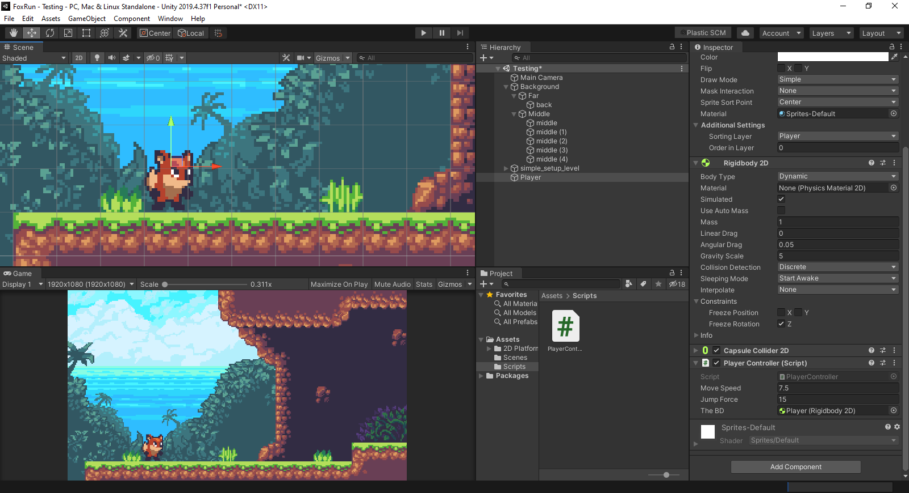

# Fox Run

Phiên bản Unity: 2019

Đôi lúc, việc cải thiện game không nằm ở việc `code` mà nằm ở những cấu hình từng rất nhiều
`component` khác nhau.

## 1. Adding Player

Mở thư mục Assets/2D Platformer/ Graphics/Player

Trong này ta sẽ thấy được 1 số sprite về nhân vật cáo.

### 1.1. Setup `player-idle`


- Pixels per units: 16
- Filter mode: point (no filter)
- Compression: none
- Sprite mode: multiple (bởi vì mình có 4 con cáo trong 1 sprite)

  - Chỉnh sửa Sprite của cáo để sử dụng trong Unity
  - Bấm vào Sprite Editor

 

- Chọn `slice`

  - type: `grid by cell size`
  - pixel size: 32 x 32 (tự đo kích thước tương ứng với mỗi sprite)

 

- Lúc tạo `sprite` này, tác giả để 1 ít phần dư, do đó trọng tâm của mỗi nhân vật sau khi cắt bị lệch quá nhiều => đặt padding để sửa

  - chọn `slice`
  - padding: `x:1`

 

- Sau khi dùng `sprite editor` để cắt nhân vật xong, ta nhấn vào `sprite` tại khung project assets, chọn hình đầu tiên của con cáo rồi kéo vào `scene`, sau đó đối tên `player-idle-0` thành `Player`


### 1.2. Sorting Sprites with Layers

1 điều quan trọng là phải đảm bảo được player ở đúng layer.

Sử dụng `sorting layer system` có sẵn trong `unity` để đảm bảo
vị trí của `player` với các `background layer` còn lại.

Chọn vào `Player object`, tại menu `layer`, chọn `add sorting layer`.

- `BG`: background
- `World`: quang cảnh thế giới
- `Player`: người chơi

Ta sẽ thêm vào các layer khác khi tiếp tục phát triển dự án


- Đặt layer của `back`, `middle` thành `BG`
- Đặt layer của `simple_setup_level` thành `World`
- Đặt layer của `Player` thành `Player`

Các `game object` được thêm vào sau sẽ mặc định layer `default`, đều
xếp trên `BG` và `Wolrd`


### 1.3. Giving player physics

- Chọn `Player` game object
- `Add Component`
- Bọc 1 lớp `Rigidbody 2D`


`Rigidbody 2D` sẽ cung cấp 1 số yếu tố vật lý được cung cấp sẵn
bởi hệ thống vật lý. Dùng cái này sẽ thuận tiện và dễ dàng hơn
so với việc tự tính toán các công thức vật lý.

Kéo con cáo đưa lên cao, sau đó nhấn vào `Play`, con cáo sẽ tự rơi xuống
do tác động của trọng lực


Con cáo rớt khỏi màn hình

Để con cáo có thể chạm vào mặt đất (tương tác với các game object khác), ta cần thêm vào 1 số tác động vật lý lên cơ thể thật (`solid body physics`)

- Chọn `Player` game object
- `Add Component`
- Chọn thư mục `Physics 2D`, chọn 1 trong các `collider` ở đây.

  - Thông thường, khi chúng ta tạo ra nhân vật, chúng ta thường
 dùng `box collider` hoặc `capsule collider`.
  - Trong trường hợp này, ta sẽ dùng `capsule collider` cho con cáo
  - Bởi vì dùng `box collider` thì nó hơi bự 1 tí so với con cáo

 

- Vòng tròn mặc định của `capsule collider` hơi to, ta cấu hình để bóp
sát `collider` vào nhân vật.

  - Chọn `component capsule collider` vừa tạo
  - Chọn `edit collider`
  - Kéo các góc sao cho vòng `collider` bao phủ phần thân của con cáo (không cần bao phủ hết)
  - Lúc này, khi thả xuống, nhân vật đã đứng trên mặt đất

 

- Vấn đề nhân vật ngã lăn ra đất

  - Khi nhân vật rớt từ trên xuống, chạm vào góc của bức tường, nó ngã
 lăn ra đất
  - Trong game này, chúng ta không muốn yếu tố vật lý này diễn ra
  - Chọn phần `rigidbody`, kéo xuống phần `constraints`, tick vào `freeze rotation` (khóa xoay)

### 1.4. Moving Player around with some Scripts

Nhấn vào `assets`, tạo folder mới `scripts` để lưu trữ toàn bộ
`scripts`.

1 số quy ước đặt tên `script` thông dụng

- Bắt đầu với chữ in hoa
- Không có dấu gạch ngang ở giữa
- Không được đổi tên `script` sau khi đã gán cho `game object`

Ví dụ, ta tạo 1 script cho đối tượng `Player`, đặt tên là: `PlayerController`

Init script

```csharp
using System.Collections;
using System.Collections.Generic;
using UnityEngine;

public class PlayerController : MonoBehaviour
{
    // Start is called before the first frame update
    void Start()
    {
        
    }

    // Update is called once per frame
    void Update()
    {
        
    }
}
```

### 1.5. Moving the Player

```csharp
using System.Collections;
using System.Collections.Generic;
using UnityEngine;

public class PlayerController : MonoBehaviour
{
    // Start is called before the first frame update
    void Start()
    {
        
    }

    // Update is called once per frame
    void Update()
    {
        
    }
}
```

- `60FPS`: `Update` is called `60 times`
- `30FPS`: `Update` is called `30 times`

Chọn đối tượng `Player`, chọn `PlayerController` script vừa tạo rồi kéo
vào khung `component`.

- Tạo biến `public` trong class, `public float moveSpeed`,
lúc này, tại component script của đối tượng `Player` sẽ có 1
field để ta có thể chỉnh sửa thông số của biến này.


Để di chuyển nhân vật, ta cần truy cập đến các hàm tại đối tượng `RigidBody2D`, đối tượng này ta đã thêm vào nhân vật để mang đến các
hiệu ứng vật lý.

- Đầu tiên, ta cần tạo 1 biến `RidigBody2D` để lưu trữ tham chiếu đến
đối tượng này. Để gán giá trị cho biến này, ta quay lại giao diện `unity`, cầm kéo
thả `component RigidBody2D` vào vị trí trống tương ứng tại phần script.

```csharp
    public Rigidbody2D theBD;
```

- Tiếp theo, ta tiến hành thêm vận tốc (`velocity`) cho nhân vật vào mỗi lần `frame update`

```csharp
    // Update is called once per frame
    void Update()
    {
        theBD.velocity = new Vector2(moveSpeed, theBD.velocity.y);
    }
```

Lúc này, sau mỗi `frame update`, nhân vật sẽ di chuyển theo trục `x` 1 khoảng cách
bằng với giá trị tại biến `moveSpeed`, còn giá trị trục `y` giữ nguyên.

- Để kiểm soát việc di chuyển của nhân vật, ta dùng `Input System` hỗ trợ sẵn từ `unity`.

```csharp
    theBD.velocity = new Vector2(moveSpeed * Input.GetAxis("Horizontal"), theBD.velocity.y);
```

- Nếu bấm mũi tên trái hoặc chữ `A`, `Input.GetAxis("Horizontal")` sẽ mang giá trị -1
- Nếu bấm mũi tên phải hoặc chữ `D`, `Input.GetAxis("Horizontal")` sẽ mang giá trị 1
- Nếu để nguyên thì mang giá trị 0

Để tìm hiểu thêm về các giá trị `Input` này, vào Menu `Edit` > `Project Settings` > `Input Manager`.

### 1.6. Jumping

- Lắng nghe sự kiện người dùng bấm vào nút `space` trong phương thức `update`.
- Tăng giá trị trục `y`, giữ nguyên giá trị trục `x`
- Nhân vật nhảy lên cao, sau đó dựa vào trọng lực để rơi xuống
- Thay đổi độ lớn của trọng lực tác dụng lên nhân vật tại `Rigidbody2D component`: `Gravity Scale`
- Tạo biến `public float jumpForce` để đặt độ cao khi nhân vật nhảy

- `gravity scale` tăng lên nghĩa là nhân vật nặng hơn, `jump force` cũng tăng theo
- `GetButtonDown` diễn ra khi người dùng vừa nhấn vào 1 nút
- `GetButton` diễn ra khi người dùng nhấn nút hoặc giữ nút
- `GetButtonUp` diễn ra khi người dùng thả nút vừa nhấn
- `Jump` là 1 giá trị trong `Input system`, vào `Input Manager` để xem chi tiết

```csharp
    void Update()
    {
        theBD.velocity = new Vector2(moveSpeed * Input.GetAxis("Horizontal"), theBD.velocity.y);

        if (Input.GetButtonDown("Jump"))
        {
            theBD.velocity = new Vector2(theBD.velocity.x, jumpForce);
        }
    }
```



### 1.7. Improving Gameplay Feel

- Khi nhảy lên rồi rớt xuống, 2 chân con cáo lún vào mặt đất, sau đó nó `reset` 2 chân lên mặt đất (cảm giác bị lag)

  - Lý do: hệ thống vật lý được chạy mỗi lần hàm `update` được gọi (xem code)
  - Trọng lực
  - Mỗi `frame update`, nhân vật rớt xuống 1 tí
  - Rớt 1 hồi thì nó nằm trong lòng đất
  - Sau đó hệ thống check `oops`, chân nhân vật này không được nằm dưới mặt đất, do đó hệ thống tự set lại, đặt nhân
 vật phía trên mặt đất
- Cách sửa: vào `component Rigidbody2d`, đặt thuộc tính `Collision detection` thành `continous`: lúc này
 mỗi lần `frame update`, hệ thống sẽ luôn check `collison` để đảm bảo rằng nhân vật không vô ý chui vào lòng đất

- Khi nhân vật đi đến chỗ cái tường (cần phải nhảy lên để vượt qua), nếu như tiếp tục
chọn mũi tên phải để đi tiếp thì khi nhảy, nhân vật sẽ bị dính vào bức tường.

  - cách giải quyết: thêm 1 đối tượng gọi là `physical material`
  - vào `assets` folder
  - chuột phải chọn `create`
  - `physics material 2D`, đặt tên là `Player Slippy`
  - Đặt thuộc tính `Friction` từ 0.4 thành 0
  
  - Mặc định nhân vật sẽ có 1 cái `physics material 2D` mang giá trị `Friction` là 0.4
  dẫn đến việc bị bug như đã mô tả. Ta ghi đè cái `physic` này để không còn bug nữa.
  - Tại `component capsule collider`, kéo cái `physic` mới này vào để thay thế cái mặc định.


Đôi lúc, việc cải thiện game không nằm ở việc `code` mà nằm ở những cấu hình từng rất nhiều
`component` khác nhau.

### 1.8. Stop Unlimited Jumping

Tạo 1 biến `boolean` lưu trữ trạng thái, nếu nhân vật đang đứng tại mặt đất thì cho
phép nhảy. Nếu nhân vật đang đứng trên không trung thì không cho phép nhảy.

Cần phải xác định được trạng thái liệu nhân vật có đang đứng trên mặt đất hay không?

Ý tưởng:

- Tạo 1 điểm ở chân của nhân vật
- Từ điêm này vẽ ra 1 vòng tròn nhỏ
- Trong phạm vi của vòng tròn này, nếu gặp đối tượng mặt đất thì => nhân vật đang đứng trên mặt đất

Làm sao để xác định đâu là mặt đất ???

Dựa vào `layer` (`unity layer system`).

#### 1.8.1. Unity Layer System

- Chọn đối tượng `simple_setup_level`, tại selectbox `layer`, bấm vào add new để
thêm mới 1 số layer, trước mắt sẽ thêm 2 layer:

  - `Ground`: những `game object` thuộc `layer` này sẽ tương ứng với phần đất
  - `Player`: những `game object` thuộc `layer` này sẽ tương ứng với người dùng

- Sau khi tạo xong `layer`, chọn `layer` cho `simple_setup_layer` là `Ground`
- Chọn `layer` cho `Player` là `Player`.


#### 1.8.2. Xác định trạng thái nhân vật đang đứng trên mặt đất

Tạo biến `bool` lưu trạng thái liệu người dùng có đang đứng trên mặt đất hay không

```csharp
  private bool isGrounded;
```

Chỉ cho phép nhảy lên khi trạng thái `isGrounded` = `true`, tức là người dùng đang đứng
trên mặt đất

```csharp
  void Update()
  {
      theBD.velocity = new Vector2(moveSpeed * Input.GetAxis("Horizontal"), theBD.velocity.y);

      if (Input.GetButtonDown("Jump"))
      {
        if (isGrounded)
        {
          theBD.velocity = new Vector2(theBD.velocity.x, jumpForce);
        }
      }
  }
```

Xác định xem người dùng có đang đứng trên mặt đất hay không?

- Tạo 1 điểm ở dưới chân của người dùng (`add game object to Player`)
- Vẽ 1 vòng tròn nhỏ có bán kính `0.2f`
- Nếu trong bán kính của vòng tròn này có sự xuất hiện của 1 vật thể thuộc layer `Ground`
tức là người dùng đang đứng trên mặt đất


Gán `Ground Point` object vào `script` để xử lý va chạm, có 2 cách:

- 1. gán như là 1 `game object`
- 2. bởi vì mình chỉ muốn biến vị trí hiện tại của đối tượng để xác định va chạm, do đó chỉ cần truyền đối tượng `Transform`

Dùng cách 2, tạo 1 biến để lưu trữ đối tượng `Transform`, đối tượng này chứa vị trí của điểm dưới chân nhân vật `Ground Point`

```csharp
  public Transform groundCheckPoint;
```

Tạo 1 biến tiếp theo để lưu trữ `layer`, biến này chỉ ra rằng hiện tại `layer` mặt đất là layer nào

```csharp
  public LayerMask whatIsGround;
```

Tại mỗi lần `update`, ta kiểm tra xem vòng tròn dưới chân nhân vật có tiếp xúc với bất kì đối tượng
nào thuộc layer `Ground` hay không

```csharp
  void Update()
  {
      theBD.velocity = new Vector2(moveSpeed * Input.GetAxis("Horizontal"), theBD.velocity.y);

      isGrounded = Physics2D.OverlapCircle(groundCheckPoint.position, .2f, whatIsGround);

      if (Input.GetButtonDown("Jump"))
      {
          if (isGrounded)
          {
              theBD.velocity = new Vector2(theBD.velocity.x, jumpForce);
          }
      }
  }
```

Result


### 1.9. Adding double jump

```csharp
void Update()
{
    theBD.velocity = new Vector2(moveSpeed * Input.GetAxis("Horizontal"), theBD.velocity.y);

    isGrounded = Physics2D.OverlapCircle(groundCheckPoint.position, .2f, whatIsGround);

    if (isGrounded) canDoubleJump = true;

    if (Input.GetButtonDown("Jump"))
    {
        if (isGrounded)
        {
            theBD.velocity = new Vector2(theBD.velocity.x, jumpForce);
        }
        else
        {
            if (canDoubleJump)
            {
                theBD.velocity = new Vector2(theBD.velocity.x, jumpForce);
                canDoubleJump = false;
            }
        }
    }
}
```

### 1.10. Animating the Player

- Tạo thư mục `assets/Animations/Player` để lưu trữ các hiệu ứng hoạt họa liên quan
đến `Player`
- Tại khung `game object`, chọn đối tượng `Player`
- Vào menu `Window`, chọn `Animation` > `Animation` rồi kéo cửa sổ này nằm cạnh
cửa sổ `Game` để thuận tiện
- Đảm bảo chọn vào đối tượng `Player` trên khung `game object`, sau đó nhấn `Create` để thêm
mới và lưu tập tin vào đúng thư mục trong `assets/Animations`, đặt tên `Player_Idle`
- Vào thư mục `assets/2D Platformer Assets/Graphics/Player` rồi tìm đến `Player Idle Sprite` đã cắt lúc trước,
kéo từng hình vào từng mốc thời gian theo thứ tự `1, 2, 3, 4`
- Để hiệu ứng chuyển động mượt thì nhớ lặp lại tấm hình số 1, lúc này thứ tự sẽ là: `1, 2, 3, 4, 1`


### 1.11. Switching Animations

Hiện tại trong game đang có 3 hiệu ứng hoạt họa dành cho `Player`

- `Player_Idle`: hoạt họa khi `Player` đứng yên trên mặt đất
- `Player_Run`: hoạt họa khi `Player` di chuyển sang trái hoặc phải (`moveSpeed` > 0)
- `Player_Jump`: hoạt họa khi `Player` nhảy lên không trung (`isGrounded` = false)

Chúng ta cần xác định và cấu hình việc chuyển cảnh các hoạt họa

- Vào menu `Windows` > `Animation` > `Animator`
  
  

- Chuột phải lên `animation` `Player_Idle`, chọn `Make transition`, sau đó kéo tới đối tượng `Player_Run`
để cấu hình hiệu ứng chuyển cảnh giữa 2 `animation` này

  - Chọn lên mũi tên vừa được tạo ra để tiến hành cấu hình
  - Chúng ta muốn hiệu ứng chuyển cảnh diễn ra ngay lập tức, do đó, đặt giá trị tại `transition duration` về `0`
  - Mặc định, `exit time` xác định thời gian 1 `animation` kết thúc và tự động chuyển sang `animation` khác. Tuy nhiên, trong
  trường hợp này, ta muốn chuyển cảnh `animation` trong 1 số điều kiện nhất định, do đó tiến hành bỏ tick tại ô `has exit time`.
  Tại thời điểm này `animation` `Player_Idle` sẽ diễn ra mãi mãi, vì vậy ta cần xác định điều kiện để chuyển cảnh sang `animation` `Player_Run`.
  - Khi người dùng di chuyển qua trái hoặc phải (`moveSpeed` > 0), lúc này người dùng đang chạy nên ta chuyển cảnh từ `Player_Idle` sang
  `Player_Run`. Chọn tab `Parameters`, tiến hành khai báo 1 biến lưu giá trị `moveSpeed`, đặt cùng tên `moveSpeed`.
  - Quay lại chọn vào mũi tên, kéo xuống dưới, tại mục `List conditions`, tiến hành thêm 1 điều kiện để kiểm tra `moveSpeed`.
  - Theo chiều từ `Player_Idle` sang `Player_Run`, `moveSpeed` sẽ có giá trị lớn hơn `0.1`
  - Theo chiều từ `Player_Run` sang `Player_Idle`, `moveSpeed` sẽ có giá trị nhỏ hơn `0.1`

- Tương tự, khi chuyển từ `Player_Idle` sang `Player_Jump`, ta đặt điều kiện tham số `isGrounded` = `false`
- Khi chuyển từ `Player_Jump` sang `Player_Idle`, ta đặt điều kiện tham số `isGrounded` = `true`

- Khi nhân vật đang chạy, có thể chuyển sang trạng thái nhảy, do đó ta chuyển từ `Player_Run` sang `Player_Jump`
với điều kiện `isGrounded` = `false`


### 1.12. Controlling the Animator through code

Tạo 1 tham chiếu đến đối tượng `Animator` để kiểm soát đối tượng này thông qua `code`.

Thay vì tạo 1 tham chiếu `public` rồi kéo đối tượng tương ứng vào. Ta có thể khai báo
1 tham chiếu `private`, sau đó, trong hàm `start`, ta tiến hành gọi hàm tương ứng để lấy
được đối tượng tương ứng đang được gắn vào `game object` hiện hành.

```csharp
  void Start()
  {
      animator = GetComponent<Animator>();
  }
```

Sau này, khi có nhiều `game object` `Player`, ta không cần phải đi gán thủ công `animator` cho
từng cái nữa.

Chuyển sang giao diện `debug` để xem rõ hơn.

Tại phần dưới cùng của hàm `update`, ta tiến hành viết code để kiểm soát đối tượng `animator` này.

Tại đây, ta dùng hàm `Set` trên đối tượng `animator` để đặt giá trị tương ứng cho các tham số
đã được khai báo trong cửa sổ `Animator` trước đó, bao gồm:

- `moveSpeed`: dùng làm điều kiện xác định việc chuyển cảnh từ `Player_Idle` sang `Player_Run`
- `isGrounded`: dùng làm điều kiện xác định việc chuyển cảnh từ `Player_Idle` sang `Player_Jump` và `Player_Run` sang `Player_Jump`

```csharp
void update()
{
    theBD.velocity = new Vector2(moveSpeed * Input.GetAxis("Horizontal"), theBD.velocity.y);

    isGrounded = Physics2D.OverlapCircle(groundCheckPoint.position, .2f, whatIsGround);

    // ...

    animator.SetFloat("moveSpeed", Mathf.Abs(theBD.velocity.x));
    animator.SetBool("isGrounded", isGrounded);
}
```

### 1.13. Changing direction

Hiện tại hiệu ứng đã có, tuy nhiên khi đi lùi, nhân vật không xoay mặt về phía sau.

Trên `component` `Sprite Renderrer` có 1 thuộc tính là `Flip`, ta có thể lật 1 `sprite` hình
thông qua 2 trục `X` và `Y`. Trong đó, việc lật trục `X` đáp ứng được yêu cầu xoay mặt nhân
vật sang trái và phải. Do đó, giờ ta sẽ tìm cách để tham chiếu đến `component` này trong `script`.

Làm tương tự như `animator`, khai báo 1 biến `private` giữ tham chiếu, sau đó gọi hàm trong `start`
để hệ thống tự động tìm và gán đối tượng `Sprite Renderrer` đang gắn với `Player game object` hiện tại

```csharp
public class PlayerController : MonoBehaviour
{
    private Animator animator;
    private SpriteRenderer theSR;

    // Start is called before the first frame update
    void Start()
    {
        animator = GetComponent<Animator>();
        theSR = GetComponent<SpriteRenderer>();
    }

    // Update is called once per frame
    void Update()
    {
        theBD.velocity = new Vector2(moveSpeed * Input.GetAxis("Horizontal"), theBD.velocity.y);

        // ...

        if (theBD.velocity.x < 0) theSR.flipX = true;
        else if (theBD.velocity.x > 0) theSR.flipX = false;

        // ...
    }
}
```

## 2. Camera

### 2.1. Attach Camera to follow the Player

Cách đơn giản nhất là kéo đối tượng `camera game object` vào đối tượng `Player game object` (để camera
là đối tượng con thuộc player). Camera sẽ di chuyển theo nhân vật, thậm chí cả khi nhảy.

Trong trò chơi này, ta không muốn điều đó diễn ra, vì vậy ta sẽ tạo `script` để điều khiển
`camera` theo ý.

- Vào folder `scripts`, tạo 1 script mới, đặt tên `CameraController`
- Kéo `script` vừa tạo này vào `camera game object`

Trong `script` này, ta cần phải tham chiếu đến 1 vật và `camera` sẽ di chuyển theo vật này.
Trong trường hợp game này, ta cần tham chiếu đến đối tượng `Player` từ `CameraController script`.

Tuy nhiên, để tái sử dụng `CameraController` này cho nhiều `game object` khác nhau, ta không nên gán
cứng kiểu dữ liệu `Player game object` vào đây.
Thay vào đó, chỉ cần giữ tham chiếu đến đối tượng `Transform` thuộc về `game object` là được.
(`camera` sẽ di chuyển dựa vào vị trí này)

Để di chuyển `camera`, ta cần chỉnh sửa vị trí `x, y, x` thuộc về thuộc tính `Transform` của
đối tượng `camera`.
Để tham chiếu đến đối tượng `Transform` của `camera`, ta chỉ cần gõ `transform` là xong. Bởi vì
hệ thống `unity` đã tự `inject` đối tượng `transform` này vào `script`.

Thay đổi vị trí hiện tại của `camera` thông qua việc đặt lại giá trị cho `transform.position`

- `x`: di chuyển theo chiều ngang của `target` (trong trường hợp này sẽ là `x` của `Player`)
- `y`: trong trường hợp này, ta không thay đổi `y`
- `z`: chiều sâu của camera, trong trường hợp này ta cũng không đổi

Sau đó quay lại giao diện `unity`, kéo đối tượng `Player game object` vào khung `Target` tại
`camera` là được. Thuộc tính `transform` trên `Player` sẽ tự động được truyền vào.

```csharp
public class CameraController : MonoBehaviour
{
    public Transform target;

    // Start is called before the first frame update
    void Start()
    {

    }

    // Update is called once per frame
    void Update()
    {
        transform.position = new Vector3(target.position.x, transform.position.y, transform.position.z);
    }
}
```


### 2.2. Adding parallax for depth

Để tạo 1 số hiệu ứng hình ảnh cho game, ta sẽ áp dụng kĩ thuật `parallax`. Di chuyển
`camera` chứa cảnh của `Player` đồng thời di chuyển `camera` chứa cảnh `Background`.

Để thử nghiệm cơ bản, ta chỉ cần kéo `game object` tên `back` trở thành con của đối tượng `camera`.

Lúc này khi nhân vật di chuyển, `camera` di chuyển theo nhân vật, `backgroud` cũng di chuyển
theo `camera`, tạo hiệu ứng thế giới đang chuyển động.

Các bước tạo hiệu ứng sinh động cho game

- Ta đã có 2 nền sẵn:
  
  - 1 nền ở xa, hình bãi biển màu xanh (`back object`)
  - 1 nền ở trung gian, hình những ngọn cây (`middle object`)

- Khi nhân vật di chuyển, ta cần di chuyển đồng thời 2 nền này. Lúc này sẽ có cả 3 thứ cùng nhau di chuyển trên màn hình, bao gồm:
camera, hình ở xa và hình ở trung gian. Trong đó, camera và hình ở xa sẽ di chuyển cùng tọa độ `x`, hình trung gian sẽ di chuyển
bằng `0.5x`. Lúc này hiệu ứng tạo ra sẽ rất tuyệt vời.

- Đầu tiên, cần phải thay đổi vị trí của 2 nền trong `CameraController script`, do đó ta sẽ lưu giữ tham chiếu đến 2 đối tượng
`Transform` tương ứng (làm như đối tượng `Player` ở trên)

- Tại mỗi khung hình `update`, ta cần tính được khoảng cách mà nhân vật đã di chuyển theo trục `x` so với `frame` trước đó
- Dựa vào khoảng cách nhân vật đã di chuyển so với `frame` trước đó, ta tính được vị trí mới của 2 hình nền

```csharp
public class CameraController : MonoBehaviour
{
    public Transform target;
    public Transform farBackground, middleBackground;

    private float lastXPosition;

    // Start is called before the first frame update
    void Start()
    {
        lastXPosition = transform.position.x;
    }

    // Update is called once per frame
    void Update()
    {
        transform.position = new Vector3(target.position.x, transform.position.y, transform.position.z);

        float amountToMoveX = transform.position.x - lastXPosition;

        farBackground.position += new Vector3(amountToMoveX, 0f, 0f);
        middleBackground.position += new Vector3(amountToMoveX * .5f, 0f, 0f);

        lastXPosition = transform.position.x;
    }
}
```


### 2.3. Clamping camera vertically

Hiện giờ, khi nhân vật di chuyển, camera cũng di chuyển theo nhưng chỉ theo trục `x`, trục
`y` và `z` giữ nguyên. Tuy nhiên, nếu làm như này thì khi nhân vật nhảy lên sẽ không có cảm giác
chân thực. Tuy nhiên, ta cũng không muốn camera đi theo trục `y` của nhân vật bởi vì lúc này camera
có thể lên quá cao hoặc quá thấp, dẫn tới lệch khỏi khung hình.

Do đó, ta cần 1 biện pháp để di chuyển trục `y` của `camera` 1 cách hợp lý.

Để làm được điều này, ta đặt 2 giá trị `minHeight, maxHeight`, quay lại `editor`, tiến hành đo đạc và
đặt giá trị cho 2 biến này. Trong đó:

- `minHeight` là giá trị `y` thấp nhất, nếu thấp hơn giá trị này sẽ không tính
- `maxHeight` là giá trị `y` cao nhất, nếu cao hơn giá trị này sẽ không tính

Lúc này, ta sẽ tính toán như sau:

- Nếu `y` của nhân vật nằm trong khoảng `minHeight` đến `maxHeight` thì dùng `c = y`
- Nếu `y` của nhân vật lớn hơn `maxHeight` thì `c = maxHeight`
- Nếu `y` của nhân vật nhỏ hơn `minHeight` thì `c = minHeight` (trường hợp này diễn ra khi nhân vật bị rớt xuống hố)

Sau đó, ta đặt `position.y` của `camera` bằng giá trị `c`.

```csharp
 transform.position = new Vector3(target.position.x, Mathf.Clamp(target.position.y, minHeight, maxHeight), transform.position.z);
```


### 2.3. Adding parallax for vertical direction

Hiện giờ việc chạy 3 cảnh song song với nhau theo trục `x` đã tạo hiệu ứng game rất đẹp.
Tuy nhiên, khi nhân vật nhảy lên, 3 cảnh không di chuyển `y` theo.

Do đó, để hoàn hảo hơn, ta đồng thời di chuyển cùng lúc nhiều cảnh ở cả 2 chiều `x` và `y`.

Trước đó, ta khai báo biến `lastXPosition` để lưu lại giá trị `X` ở `frame` cũ, sang `frame` mới
dựa vào vị trí mới và giá trị `x` này để tính được khoảng cách mà nhân vật đã di chuyển. Từ đó,
tính toán được khoảng cách mới cho các cảnh vật ở phía sau.

Tuy nhiên, lúc này ta đồng thời phải lưu giữ cả `x` và `y`. Ta có thể tạo thêm biến `lastYPosition`,
tuy nhiên, để thuận tiện hơn, ta có thể lưu vào `Vector2`

```csharp
public class CameraController : MonoBehaviour
{
    private Vector2 lastPosition;

    // Start is called before the first frame update
    void Start()
    {
        lastPosition = transform.position;
    }

    // Update is called once per frame
    void Update()
    {
        Vector2 amountToMove = new Vector2(transform.position.x - lastPosition.x, transform.position.y - lastPosition.y);

        farBackground.position += new Vector3(amountToMove.x, amountToMove.y, 0f);
        middleBackground.position += new Vector3(amountToMove.x, amountToMove.y, 0f) * .5f;

        lastPosition = transform.position;
    }
}
```
